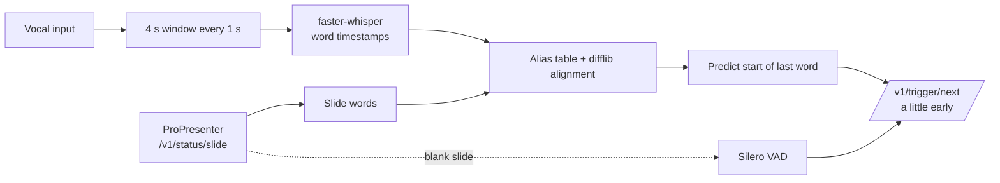
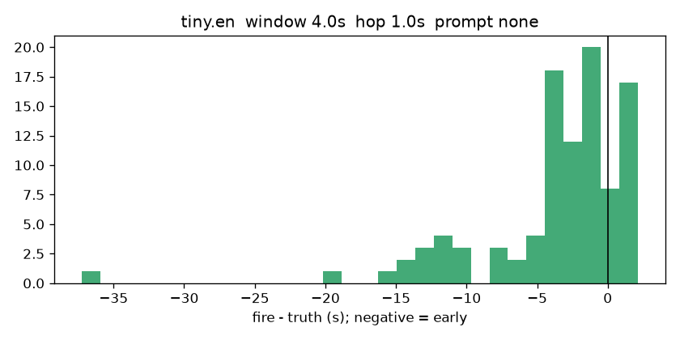
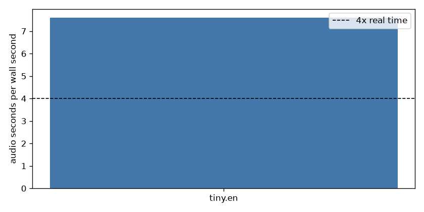
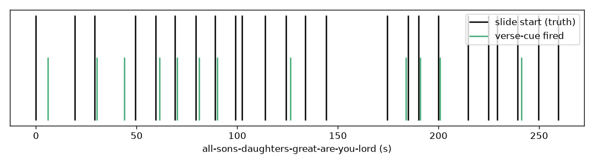

# verse-cue

Auto-advance ProPresenter lyric slides from a live vocal feed. No song files, no
training: verse-cue reads the slide that is on screen, listens, and triggers the
next slide as the singer reaches the last word.

## How it works

Early beats late. The predicted fire time is the start of the last word minus
`lead_s`. Blank (instrumental) slides advance on the first voice. If you change
a slide by hand, verse-cue notices the new uuid and starts over.

## Install (Windows or Mac, 5 steps)

1. Install uv: https://docs.astral.sh/uv/getting-started/installation/
2. `uv tool install "verse-cue[cuda] @ git+https://github.com/AustinDKB/verse-cue"` (drop `[cuda]` on a Mac or a PC without an NVIDIA GPU)
3. In ProPresenter: Preferences -> Network -> enable the network API, note the port (default 1025)
4. `verse-cue --setup` — pick your vocal input, confirm the port
5. `verse-cue`

Optional: `verse-cue-harvest bench` picks the best model and window for your hardware (needs `ffmpeg` and `yt-dlp` on PATH).

## Measured

First CPU bench on this machine: five YouTube mixes, LRC line times as slide truth,
`tiny.en`, 4 s window, 1 s hop, `prompt_mode = none`. `select()` did not pick a
winner: `false_pct` 14.0 is above the 5.0 gate. Raw row:

| name | window_s | hop_s | prompt_mode | rtf | median_delta | p90_abs_delta | early_pct | late_pct | missed_pct | false_pct |
|---|---|---|---|---|---|---|---|---|---|---|
| tiny.en | 4.0 | 1.0 | none | 7.6 | -2.31 | 11.78 | 49.0 | 7.0 | 36.9 | 14.0 |

Median fire is 2.3 s early; 37% of slides were missed (operator fallback in the
harness). Studio mix vs a live vocal feed will move these numbers. Re-run
`verse-cue-harvest bench` on the church GPU with the full model grid.

## Configuration

One file, `verse-cue.toml`.

- `[propresenter]` host and port
- `[audio]` input device name
- `[model]` Whisper id, window, hop, prompt mode
- `[decide]` lead, guard, match thresholds
- `[blank]` VAD settle for instrumental slides
- `[hardware]` GPU VRAM table used until you bench
- `[alias]` / `[bench]` harvest-tool settings

`verse-cue.auto.toml` (written by bench) overrides `[model]`.

## Limitations

- Bench and alias audio are studio mixes from YouTube; the live feed is voice-only. Expect the numbers to shift.
- Word timestamps are about ±100 ms; the last-word prediction is extrapolated, not syllable-exact.
- CPU-only machines may not reach 4x real time on `small.en`; the bench falls back to `base.en` or `tiny.en`.
- `prompt_mode = "slide"` can make Whisper parrot the slide. The bench measures `false_pct` per mode; check it.

## Help wanted

Run a Sunday, send `metrics.jsonl`, your `docs/metrics/summary.md`, and your hardware. Open an issue.

## Project history

`docs/ORIGINAL-PLAN.md` is the plan this started from. `docs/superpowers/` has the spec and the implementation plan. `docs/COST.md` has what it cost to build. `docs/brain-dump.md` is the raw first dump.
