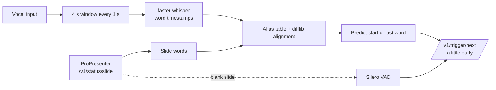

# verse-cue

Auto-advance ProPresenter lyric slides from a live vocal feed. No song files, no
training: verse-cue reads the slide that is on screen, listens, and triggers the
next slide as the singer reaches the last word.

## How it works



Early beats late. The predicted fire time is the start of the last word minus
`lead_s`. Blank (instrumental) slides advance on the first voice. If you change
a slide by hand, verse-cue notices the new uuid and starts over.

## Copy-paste prompt

Paste this into Cursor (or a terminal, line by line). Drop `[cuda]` on a Mac or
a PC without an NVIDIA GPU. Install uv first if needed:
https://docs.astral.sh/uv/getting-started/installation/

```
uv tool install --refresh "verse-cue[cuda] @ git+https://github.com/AustinDKB/verse-cue"
verse-cue --setup
verse-cue
```

`--setup` lists input devices, then asks for the ProPresenter computer's IP
(default `127.0.0.1` if it is this machine) and port (default `1025`). It prints:

- `verse-cue will connect to ProPresenter at <ip>:<port>` — that is the address
  verse-cue calls
- `This computer's IP: …` — use this as the ProPresenter IP if verse-cue and
  ProPresenter are on different computers
- Enable in ProPresenter: **Preferences → Network → Network API**, same port

Live config is already locked in the bundled `verse-cue.toml`: `small.en`,
window 4 / hop 1, `prompt=none`, last-3 + first-half + min_matched 4, deadline
off. `--setup` only writes the mic and the ProPresenter host/port.

Optional: `verse-cue-harvest vocals` writes `data/vocals/` stems (Demucs; mixes stay for alias mining). Then `verse-cue-harvest bench` prefers those stems (needs `ffmpeg` and `yt-dlp` on PATH).

## Measured

Live pick after the GPU passes: `small.en`, false **14.6** / miss **25.9** /
p90 **12.1** (hop 0.5; production hop is 1.0 so RTF stays above 4×). What moves
each metric: [docs/metrics/miss-and-false.md](docs/metrics/miss-and-false.md).


## Configuration

One file, `verse-cue.toml`.

- `[propresenter]` host and port
- `[audio]` input device name
- `[model]` Whisper id, window, hop, prompt mode
- `[decide]` lead, guard, match thresholds
- `[blank]` VAD settle for instrumental slides
- `[hardware]` fallback only if `[model].name` is empty (live name is `small.en`)
- `[alias]` / `[bench]` harvest-tool settings

`verse-cue.auto.toml` (written by bench) overrides `[model]`. Do not drop one in
for tonight — it would replace the locked live model.

## Limitations

- Bench and alias audio are studio mixes from YouTube; the live feed is voice-only. Expect the numbers to shift.
- Word timestamps are about ±100 ms; the last-word prediction is extrapolated, not syllable-exact.
- CPU-only machines may not reach 4x real time on `small.en`; the bench falls back to `base.en` or `tiny.en`.
- `prompt_mode = "slide"` can make Whisper parrot the slide. The bench measures `false_pct` per mode; check it.

## Help wanted

Run a Sunday, send `metrics.jsonl`, your `docs/metrics/summary.md`, and your hardware. Open an issue.

## Project history

`docs/ORIGINAL-PLAN.md` is the plan this started from. `docs/superpowers/` has the spec and the implementation plan. `docs/COST.md` has what it cost to build. `docs/brain-dump.md` is the raw first dump.
