<!-- print.css companion: metrics-against-slop.html embeds the same tokens -->

# Metrics Against Slop

**Local metrics keep one function readable. Graph and diff metrics keep the system from turning into a cathedral of one-liners.**

Skim field cards in five minutes. Work Shopapi S1 vs S2 in twenty. Run Threshold Lab in forty-five.

---

## How to read this

| Path | Time | Do this |
| --- | ---: | --- |
| Field cards | ~5 min | [Field cards](#field-cards) + [checklist](#13-review-checklist-90-seconds) |
| Spine | ~20 min | [Slop](#1-slop-and-the-helper-reward-trap) → [S1 vs S2](#9-feature-case-study-s1-vs-s2) |
| Lab | ~45 min | [Threshold Lab](#11-threshold-lab-tutorial) |
| Machine | — | [YAML](#machine-readable-thresholdsyaml) |

Callouts: `DEFINITION` · `EXAMPLE` · `SLOP SIGNATURE` · `THRESHOLD LAB` · `FALSE POSITIVE` · `DO THIS`
IDs: `F1`–`F7` · `S1`–`S2` · `M1`

Print copy: `metrics-against-slop.html` is a frozen snapshot from 2026-09-03 and is not regenerated. This Markdown file is the maintained source.

---

## Cover thesis

### What this is

**Cyclomatic** ≈ paths to test. **Cognitive** ≈ how hard the function is to read. Cognitive does **not** tax helper calls — it often **rewards** extracting them. That is why LLMs emit **slop** that still looks simple.

Size caps stop monster files; alone they cause file explosion. Graph metrics catch what lives **between** functions: fan-in-1 wrappers, depth ladders, edge churn, cycles.

**A function can be healthy while the service is stinky.** That is the lesson. Numbers below prove it.

### Picture — failure mode

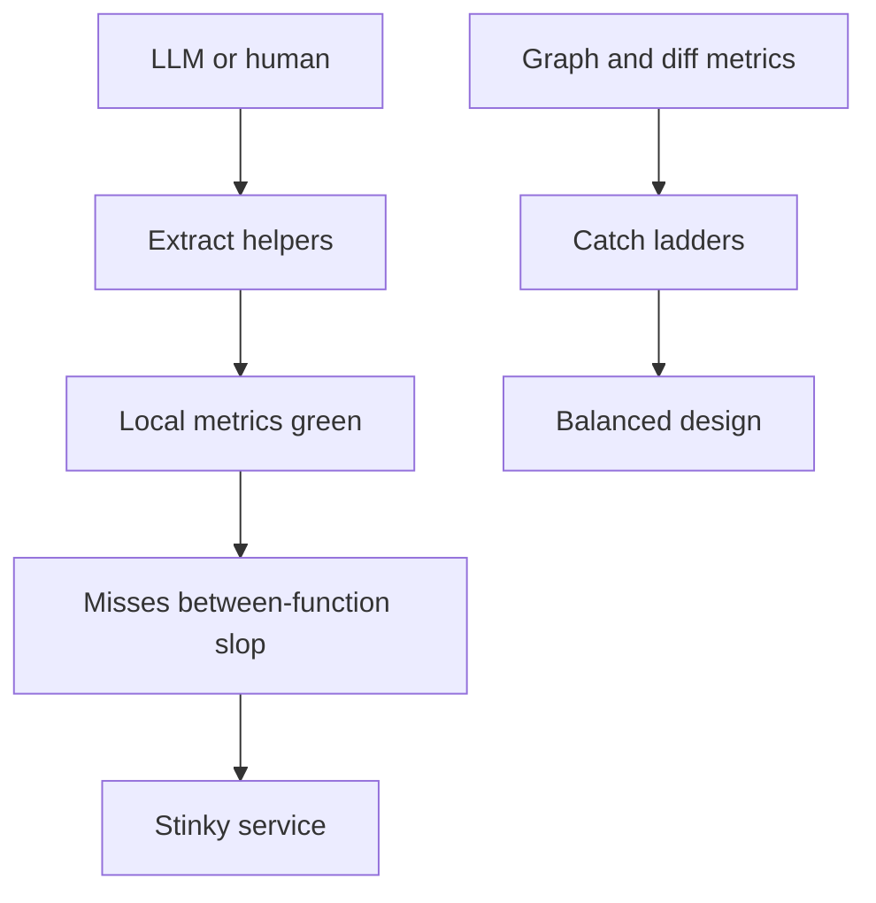

*Local green ≠ system green. Graph gates sit beside complexity linters, not instead of them.*

### Teaching sentence

> **Local metrics keep one function readable. Graph and diff metrics keep the system from turning into a cathedral of one-liners.**

Cell metrics: cyclo, cognitive, nesting, length. Organ metrics: fan-in, depth, FI1 count, cycles, affected tests. When they conflict and the graph got simpler, prefer the graph.

---

## Table of contents

1. [Slop and the helper-reward trap](#1-slop-and-the-helper-reward-trap)
2. [Metric map by layer](#2-metric-map-by-layer)
3. [Control-flow metrics](#3-control-flow-metrics) — F1, F2, F4
4. [Size and token budgets](#4-size-and-token-budgets) — F7
5. [Code graphs 101](#5-code-graphs-101)
6. [Node-level graph metrics](#6-node-level-graph-metrics) — F3, F5, F6
7. [Graph-level and diff metrics](#7-graph-level-and-diff-metrics)
8. [Architecture / slop-shape checks](#8-architecture--slop-shape-checks)
9. [Feature case study S1 vs S2](#9-feature-case-study-s1-vs-s2)
10. [Healthy functions, stinky service](#10-healthy-functions-stinky-service) — M1
11. [Threshold Lab tutorial](#11-threshold-lab-tutorial)
12. [Putting gates in CI](#12-putting-gates-in-ci)
13. [Review checklist (90 seconds)](#13-review-checklist-90-seconds)
14. [Agent / LLM prompt snippet](#14-agent--llm-prompt-snippet)
15. [Field cards](#field-cards)
16. [Glossary](#glossary)
17. [Index of examples](#index-of-examples)
18. [machine-readable-thresholds.yaml](#machine-readable-thresholdsyaml)

---

## 1. Slop and the helper-reward trap

### What this is

**Slop** is code that passes local complexity caps but is still hard to understand as a system. Helper farms, call ladders, fake layers, one-use wrappers, unused types, and “clean” functions that together make a stinky module.

### Picture — helper reward trap

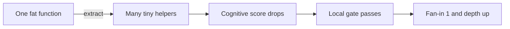

*Notice: extraction is free for cognitive complexity. Graph cost is not free.*

> **DEFINITION**
> **Slop** = locally green, systemically red. The smell lives in edges and depth, not in a single function’s nesting.

> **SLOP SIGNATURE**
> Private function, body ≤ 4 statements, fan-in = 1, name is a verb of a verb (`ensure_items`, `check_order`). Depth from public entry ≥ 4.

> **DO THIS**
> Keep extraction when fan-in ≥ 2 **or** the name is durable domain language. Otherwise inline.

---

## 2. Metric map by layer

### What this is

Metrics live on layers. Never mix call-graph edges with import-graph edges in one score.

### Picture — layer cake

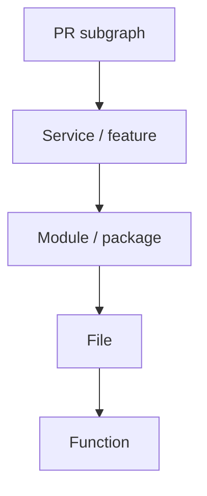

*Notice: most slop gates should fire on the PR subgraph and public entry depth, not on repo-wide averages.*

| Layer | Metrics that belong here | Typical tools |
| --- | --- | --- |
| Function | Cyclomatic, cognitive, nesting, returns, statements, length | Ruff PLR091x, complexipy, radon cc |
| File | SLOC, tokens, functions per file | cloc, token estimate, radon |
| Module | Import fan-in/out, Martin I/A/D, isolates | importlinter, CodeGraph module graph |
| Service | Depth from entry, diameter, ΔV/ΔE, new types | callers/callees/impact on changed symbols |
| PR | ΔE/ΔV, new cycles, affected tests, new private fan-in 1 | git diff + CodeGraph JSON |

---

## 3. Control-flow metrics

### What this is

Control-flow metrics count branches and nesting **inside** one function. They cannot see wrappers next door.

### Field pattern for each metric

One-line meaning → tiny formula → good example → slop example → what changes → how to pick a limit.

---

### 3.1 Cyclomatic complexity (McCabe)

> **DEFINITION**
> **Cyclomatic complexity** ≈ how many independent paths to test in this function.

**Formula (simplified, structured code):**

\[
V(G) = E - N + 2
\]

Practical count: start at 1; +1 per `if` / `elif` / `for` / `while` / `except` / `and` / `or` / `case` arm (tool-specific).

**Unit:** dimensionless path count.

**Good at:** test-path budgeting; spotting huge decision trees.

**Cannot see:** helpers you call; whether a flat `match` is readable.

#### EXAMPLE — F2 flat match (high cyclo, low cognitive)

```python
# F2 — healthy shape for many status codes
def http_label(status: int) -> str:
    match status:
        case 200:
            return "ok"
        case 201:
            return "created"
        case 400:
            return "bad_request"
        case 401:
            return "unauthorized"
        case 403:
            return "forbidden"
        case 404:
            return "not_found"
        case 409:
            return "conflict"
        case 422:
            return "unprocessable"
        case 429:
            return "rate_limited"
        case 500:
            return "error"
        case _:
            return "other"
```

| Metric | Value | Note |
| --- | ---: | --- |
| cyclomatic | ~11 | One + per arm (tool-specific) |
| cognitive | ~1–3 | Flat `match` stays cheap |
| nesting | 1 | |

> **FALSE POSITIVE**
> High cyclo on a flat match table. Do **not** extract twelve one-line functions.

#### Contrast — nested vs flat (same cyclo family, different cognitive)

| Shape | Cyclomatic | Cognitive |
| --- | ---: | ---: |
| Flat `match` / long `elif` / sequential guards | High | Relatively low |
| Deeply nested `if` | Similar | Much higher |

---

### 3.2 Cognitive complexity (Sonar-style)

> **DEFINITION**
> **Cognitive complexity** ≈ how hard this function is to read: nesting plus flow breaks.

**Rules (teaching summary):**

| Event | Cost |
| --- | --- |
| `if` / `for` / `while` / `except` | +1, plus +1 per nesting level |
| `elif` / `else if` | +1 |
| `else` | usually 0 (structure already paid) |
| `match` / `switch` | often cheap vs the same logic as nested `if`s (tool/language vary) |
| Break in `and`/`or` sequences | +1 |
| Recursion | counts (not free) |
| **Function / method calls** | **free** |

Numbers in this manual are **teaching estimates**. Your linter’s exact score may differ by 1–2; the *shape* (flat vs nested, helper ladder vs inline) is what matters.

**Unit:** dimensionless read-cost score.

**Good at:** spotting deep nesting and tangled control flow.

**Cannot see:** one-use helpers; call ladders; file explosion.

> **SLOP SIGNATURE**
> Cognitive ≤ 3 on every function, yet eight new private nodes for one route.

---

### 3.3 Max nesting depth

> **DEFINITION**
> **Max nesting depth** = deepest control-structure stack inside the function.

**Formula:** max depth of nested `if`/`for`/`while`/`with`/`try` blocks (0- or 1-based by tool; pick one and stick to it).

**Good at:** catching pyramid code.

**Cannot see:** long flat decision tables (those are often fine).

---

### 3.4 Branches / returns / statements (Ruff-style PLR091x)

| Ruff family | Counts | Protects | Misses |
| --- | --- | --- | --- |
| PLR0912 | branches | Monster decision functions | Readable flat matches |
| PLR0911 | returns | Spaghetti exits | Guard-clause style |
| PLR0915 | statements | Runaway bodies | Dense but linear parsers |
| PLR0913 | args | Parameter bags | Genuine constructors |

---

### F1 Nested ifs vs early returns

> **EXAMPLE**
> F1 — nested ifs vs early returns. Same cyclomatic, lower cognitive, zero graph change.

**Before (nested):**

```python
def can_ship(order, stock, user):
    if order is not None:
        if user.is_active:
            if stock.available(order.sku) >= order.qty:
                if not order.blocked:
                    return True
    return False
```

**After (early returns):**

```python
def can_ship(order, stock, user):
    if order is None:
        return False
    if not user.is_active:
        return False
    if stock.available(order.sku) < order.qty:
        return False
    if order.blocked:
        return False
    return True
```

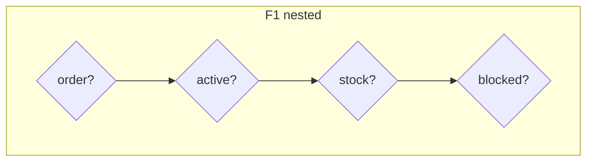

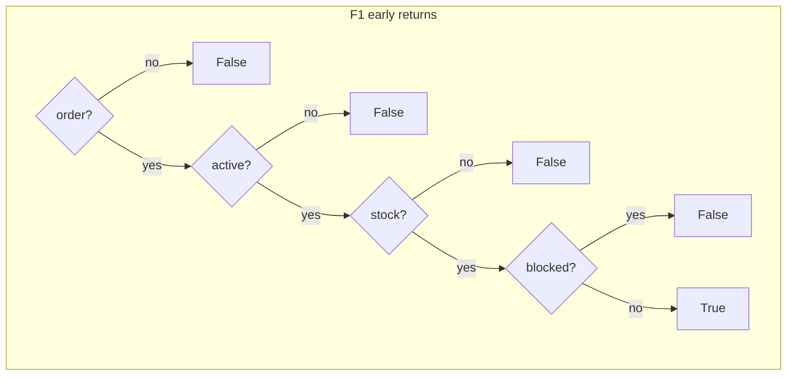

*Notice: cyclomatic stays similar; cognitive and nesting drop with early returns.*

| Version | cyclo | cognitive (approx) | nest |
| --- | ---: | ---: | ---: |
| Nested | ~5 | ~10 | 4 |
| Early returns | ~5 | ~4 | 1 |

### F4 — same checks, same lesson

F4 is F1 restated: a **guard list** (sequential) beats a **nested pyramid** of the same predicates. Cyclo stays similar; cognitive and nesting drop. Prefer guards for preconditions.

> **THRESHOLD LAB**
> Cognitive fail > 15 (Sonar default) or team 8–10. Nesting: warn at 3, fail above 4. Cyclomatic warn 8–10 / fail 10–15 — allow flat match tables.

> **DO THIS**
> Pair Ruff/complexipy with graph gates. Local-only gates train models to emit ladders.

---

## Field card — Complexity family

| Metric | Start-here fail | Warn | Protects | Misses |
| --- | --- | --- | --- | --- |
| Cognitive / fn | >15 or team 8–10 | 8–15 | Nested spaghetti | Helper farms |
| Cyclomatic / fn | >10–15 | 8–10 | Untestable blobs | Flat matches |
| Nesting | >4 | ≥3 | Pyramids | Flat tables |
| Returns | team choice | — | Spaghetti exits | Guard clauses |
| Statements | team choice | — | Runaways | Dense parsers |

**If two designs pass:** fewer helpers, shallower nesting, domain names.

---

## 4. Size and token budgets

### What this is

Size metrics bound human and LLM edit context. They do not measure design quality.

### File SLOC vs file tokens

Rough teaching conversion: **≈ 4 characters per token**. About **100 lines ≈ 500–1000 tokens** depending on density.

| Budget idea | Lines | Tokens (approx) | Why |
| --- | ---: | ---: | --- |
| Comfortable LLM edit | 300–600 | ~3k–6k | Fits edit + surrounding context |
| Warn | ~250 SLOC / ~2.5k tokens | — | Review friction rising |
| Fail (start-here) | >400–500 SLOC / >4k tokens | — | Exclude generated |

> **DEFINITION**
> **LLM-edit budget** = how much of a file you can change while still holding enough surrounding context to avoid hallucinated APIs.

### Function length / functions per file / public methods per class

| Metric | Start-here | Misses |
| --- | --- | --- |
| Function length | team; often warn >40–60 SLOC | Call ladders of tiny fns |
| Functions per file | warn when file is a bag of one-use helpers | Cohesive domain file |
| Public methods / class | warn when façade grows for one route | Real aggregate roots |

### F7 File split that helps vs slop

> **EXAMPLE**
> F7 — file split that helps vs slop.

Same total LOC. Different graphs.

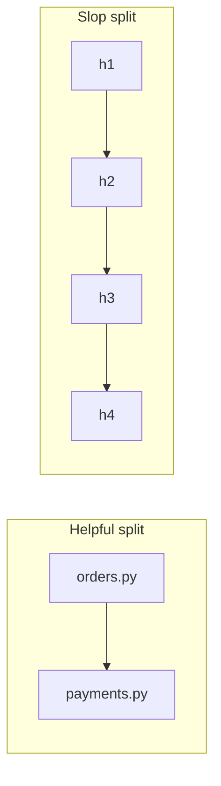

*Helpful: two cohesive modules. Slop: a ladder of tiny files with fan-in 1.*

| Split | Files | Fan-in-1 private | Depth | LLM effect |
| --- | ---: | ---: | ---: | --- |
| Helpful | 2 cohesive modules | 0 | ≤3 | Clear ownership |
| Slop | 8 × 30-line files | 7 | 6 | Context hops |

> **SLOP SIGNATURE**
> Size cap without fan-in rule → 40 files of 30 lines.

> **DO THIS**
> Cap size **and** require fan-in ≥ 2 for new private helpers (unless public entry).

---

## Field card — Size family

| Metric | Start-here fail | Warn | Notes |
| --- | --- | --- | --- |
| File tokens | >4k | 2.5k | Exclude generated |
| File SLOC | >400–500 | 250 | |
| Functions / file | smell if many fan-in 1 | — | Pair with graph |
| Public methods / class | >1 new façade type for one route | — | Ceremony |

---

## 5. Code graphs 101

### What this is

Build **three graphs**. Never mix kinds in one score.

| Graph | Nodes | Edges |
| --- | --- | --- |
| Call graph | functions / methods | calls |
| Module graph | files / packages | imports |
| Type graph | classes | extends / implements |

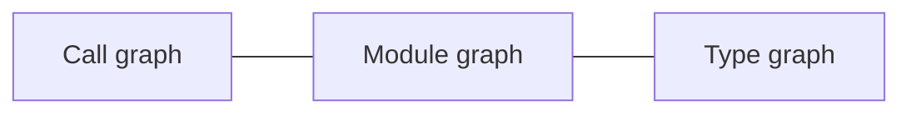

*Notice: a clean call graph can still sit on a tangled import graph. Measure the graph that matches the question.*

### CodeGraph-style commands → metrics

Installed CLI exposes `codegraph query` / `codegraph node`. Degrees (fan-in, fan-out, depth) come from the SQLite index via `scripts/slop_gate.py`.

| Command | Use for |
| --- | --- |
| `codegraph query <name> --json` | symbol lookup |
| `codegraph node <name>` | trail / neighborhood |
| `scripts/slop_gate.py` reads `.codegraph/codegraph.db` (`edges.kind = 'calls'`) | fan-in, fan-out, depth |
| `query` / `status` | inventory — not degrees |

> **FALSE POSITIVE**
> Treating inventory node counts as coupling metrics.

---

## 6. Node-level graph metrics

### What this is

Node metrics describe one symbol’s neighborhood on **one** graph kind.

| Metric | Formula / meaning | Gate? |
| --- | --- | --- |
| Fan-in | \(\deg^-(v)\) = in-repo callers | **yes** — FI1 smell |
| Fan-out | \(\deg^+(v)\) = callees | **yes** — hubs |
| Degree | \(\deg^- + \deg^+\) | info |
| Risk product | \(\deg^- \times \deg^+\) | info / smell |
| Henry–Kafura IFC | \(\mathrm{length} \times (\deg^- \times \deg^+)^2\) | teaching only |
| Reach @ k | nodes within depth k | **yes** via impact |
| Depth from public entry | hops from API/entrypoint | **yes** |
| Betweenness | share of shortest paths | PR subgraph only |
| Clustering | star vs clique | shape check |
| % new callees | new / all callees in diff | smell |
| Isolates | degree 0 | **yes** if new dead |

**Fan-in in this manual** counts **in-repo** callers. Framework entry wiring (FastAPI → route) is ignored unless your indexer includes it.

**Henry–Kafura example:** length 10, fan-in 1, fan-out 1 → \(10 \times (1\times1)^2 = 10\). Same length, fan-in 3, fan-out 3 → \(10 \times 9^2 = 810\). Classic paper formula; we do **not** gate on raw IFC alone.

**Good at:** wrappers (FI1), hubs, blast radius.
**Cannot see:** domain naming; whether a hub is a real composition root (`main`, router).

### F3 One-use wrapper

> **EXAMPLE**
> F3 — one-use wrapper.

```python
def is_active_user(user):
    return user.is_active


def place_order(user, cart):
    if not is_active_user(user):
        raise Denied
    ...
```

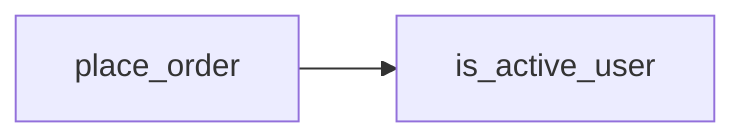

*One edge into `is_active_user` → fan-in 1. Inline it.*

| name | loc | cyclo | cognitive | fan-in | fan-out |
| --- | ---: | ---: | ---: | ---: | ---: |
| `is_active_user` | 2 | 1 | 0–1 | **1** | 0 |

> **SLOP SIGNATURE**
> All local metrics fine; **fan-in = 1** is the smell. Inline unless a second call site appears.

### F6 True helper worth extracting

> **EXAMPLE**
> F6 — true helper worth extracting.

`parse_money` used in 3 call sites. Fan-in 3. Name is domain language.

| name | fan-in | local metrics | Verdict |
| --- | ---: | --- | --- |
| `parse_money` | 3 | low | Keep |

### F5 After inlining S1 wrappers

> **EXAMPLE**
> F5 — after inlining S1 wrappers.

`place_order` cognitive rises (e.g. 2 → 6). Module depth and ΔE/ΔV fall. **Accept the local rise.**

| View | Before (S1-like) | After inline |
| --- | --- | --- |
| `place_order` cognitive | 2 | 6 |
| Max depth | 6 | 2–3 |
| Fan-in-1 privates | many | 0 |
| Service smell | red | green |

---

## Field card — Graph node family

| Metric | Start-here fail | Warn | Notes |
| --- | --- | --- | --- |
| New private fan-in | =1 and body ≤4 stmts | =1 | Unless public entry |
| Fan-out (no stdlib) | >8 | 6–8 | Allowlist composition roots |
| Depth from entry | >3 | =3 | |
| Isolates / unused | >0 new dead | — | Delete |
| Betweenness | PR subgraph only | — | Repo-wide is noisy |

---

## 7. Graph-level and diff metrics

### What this is

Gate the **PR subgraph**, not repo-wide averages.

| Metric | Formula | Role |
| --- | --- | --- |
| ΔV | net new nodes | churn |
| ΔE | net new edges | churn |
| ΔE/ΔV | \(\Delta E / \Delta V\) if ΔV > 0 | **secondary** — only fail with many FI1 |
| Diameter | longest shortest path | ladder risk |
| New cycles / SCC | new cycles in subgraph | **fail > 0** |
| Avg degree / density | \(m/n\), \(m/(n(n-1))\) | informational |
| Propagation cost | reach of changed hubs | informational |
| Martin Ca, Ce, I, A, D | package coupling / abstractness | informational |

> **THRESHOLD LAB**
> Primary rejects for ladders: **FI1 count**, **depth > 3**, **new cycles**, **0 affected tests**.
> ΔE/ΔV > 2.5 is a fail **only when** the new graph is full of fan-in-1 nodes. A short balanced graph can have a “high” ratio and still be fine (see S2).

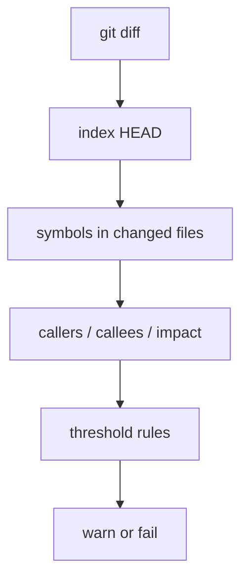

*Inventory is not a gate. Degrees and impact on the changed set are.*

---

## Field card — Diff / architecture family

| Metric | Start-here fail | Warn | Notes |
| --- | --- | --- | --- |
| New private FI1 + tiny body | yes | FI1 alone | Primary |
| Depth from entry | >3 | =3 | Primary |
| New cycles | >0 | — | Primary |
| Affected tests | 0 on behavior change | — | Primary |
| ΔE/ΔV | >2.5 **and** many FI1 | >2 + FI1 | Secondary |
| New types / PR | >1 unless domain concept | — | Ceremony |
| Max new files | smell with FI1 swarm | — | |

---

## 8. Architecture / slop-shape checks

| Check | Rule | Why |
| --- | --- | --- |
| One-use helper | fan-in 1 + tiny body + private → reject or inline | Cathedral of one-liners |
| Call-depth budget | ≤ 3 from public entry | Ladders |
| Max new files / types / abstracts | tight per PR | Fake layers |
| Forbidden ceremony names | `*Factory`, `*Manager`, `Base*`, Protocol with one impl | Name cosplay |
| Dead code | new isolates | Unused types |
| Mock-only private tests | tests that only assert mocks of private helpers | Structure lock-in |
| Dup vs forced generic | need **both** gates | Blind DRY creates wrong abstractions |

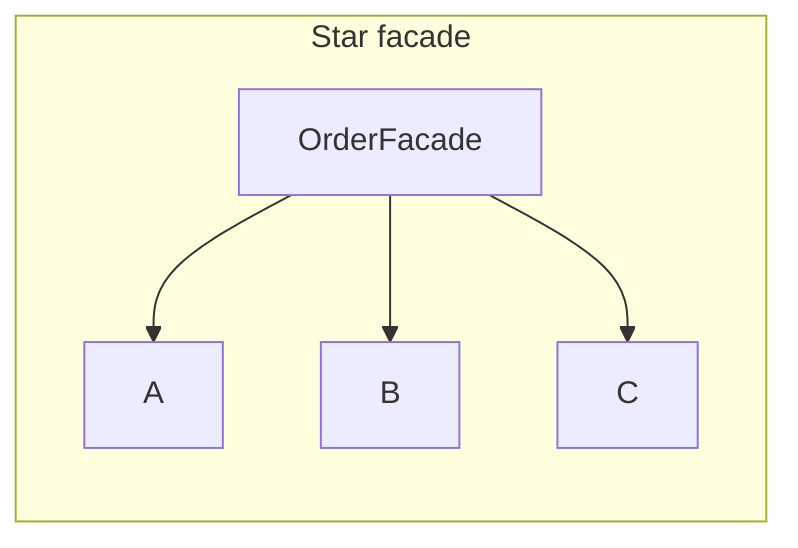

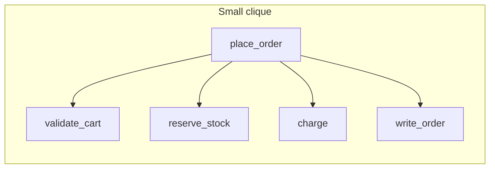

*Notice: star with one entry and fan-in-1 leaves is often ceremony. Small clique of domain verbs is usually the balanced design.*

---

## 9. Feature case study: S1 vs S2

**Product:** **Shopapi** — small order service. HTTP place-order → validate cart → charge payment → reserve stock → write order.

### S1 — Slop design (metric-clean functions, stinky service)

`POST /orders` as:

`route → handle_order → process_order → validate_order → check_order → ensure_items → ensure_user → charge_and_save → save_order`

Each function 4–10 lines; cognitive 1–3; cyclomatic 1–3.

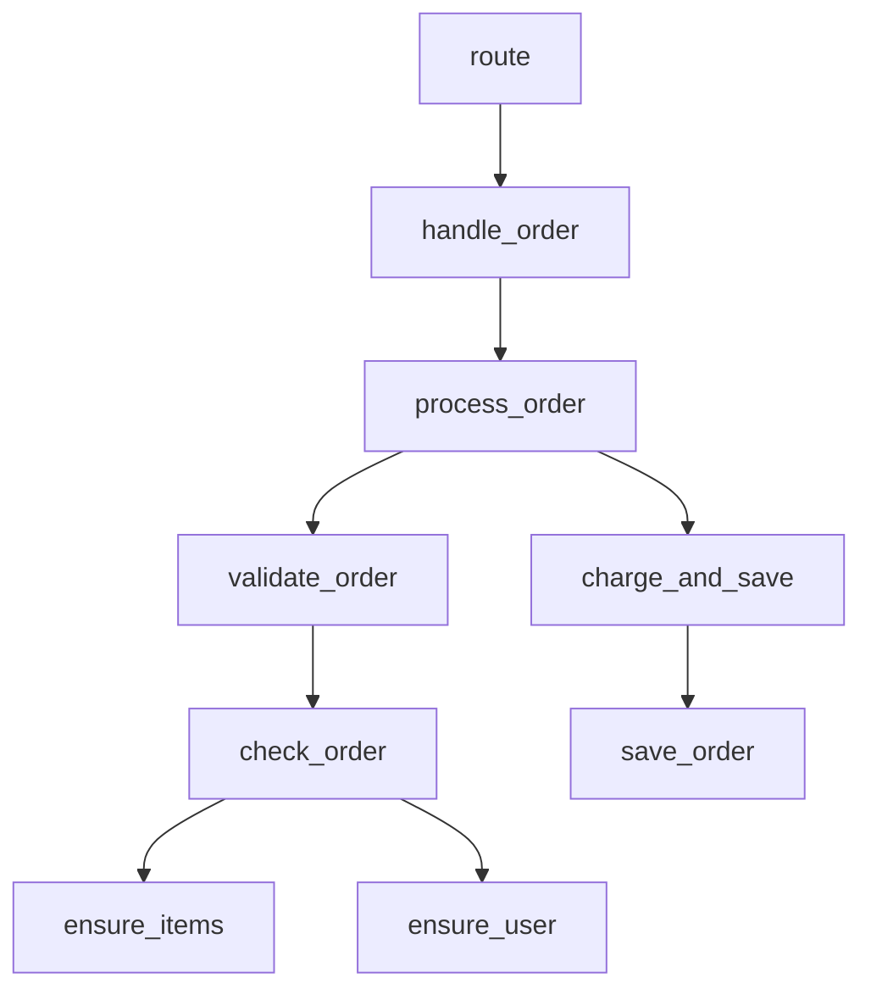

*Notice: every node is locally green. Depth and fan-in-1 edges make the service red.*

#### S1 function table

| name | loc | tokens | cyclo | cognitive | nest | fan-in | fan-out | depth-from-entry | new-callee-% | impact@3 |
| --- | ---: | ---: | ---: | ---: | ---: | ---: | ---: | ---: | ---: | ---: |
| route | 6 | 40 | 1 | 1 | 0 | 0 | 1 | 0 | 100 | 8 |
| handle_order | 5 | 35 | 1 | 1 | 0 | 1 | 1 | 1 | 100 | 7 |
| process_order | 8 | 55 | 2 | 2 | 1 | 1 | 2 | 2 | 100 | 6 |
| validate_order | 6 | 40 | 2 | 2 | 1 | 1 | 1 | 3 | 100 | 4 |
| check_order | 7 | 45 | 2 | 2 | 1 | 1 | 2 | 4 | 100 | 3 |
| ensure_items | 5 | 30 | 2 | 2 | 1 | 1 | 0 | 5 | 0 | 1 |
| ensure_user | 4 | 25 | 2 | 1 | 1 | 1 | 0 | 5 | 0 | 1 |
| charge_and_save | 9 | 60 | 3 | 3 | 1 | 1 | 1 | 3 | 100 | 2 |
| save_order | 5 | 30 | 1 | 1 | 0 | 1 | 0 | 4 | 0 | 1 |

#### S1 service table

| ΔV | ΔE | ΔE/ΔV | diameter | max depth | FI1 privates | cycles | files | public API | affected tests |
| ---: | ---: | ---: | ---: | ---: | ---: | ---: | ---: | ---: | ---: |
| 9 | 8 | 0.89 | 6 | 6 | **8** | 0 | 4 | 1 | **0** |

ΔE/ΔV looks mild (8/9). **Reject on FI1=8, depth=6, tests=0** — not on the ratio.

> **SLOP SIGNATURE — S1**
> Ladder of private fan-in-1 helpers; depth 6; no behavior tests; optional Facade/Service/Validator for one route.

---

### S2 — Balanced design (same behavior)

`place_order` (public) calls existing or twice-used `validate_cart`, `reserve_stock`, `charge`, `write_order`.

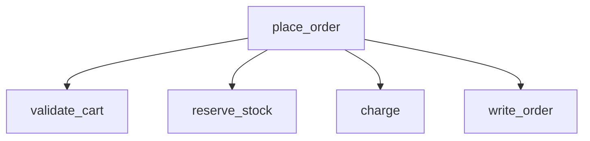

*Notice: depth ≤ 2. Shared helpers can have fan-in ≥ 2. Public function may look “worse” locally.*

#### S2 function table

| name | loc | tokens | cyclo | cognitive | nest | fan-in | fan-out | depth-from-entry | new-callee-% | impact@3 |
| --- | ---: | ---: | ---: | ---: | ---: | ---: | ---: | ---: | ---: | ---: |
| place_order | 28 | 160 | 6 | 6 | 1 | 1 | 4 | 0 | 25 | 5 |
| validate_cart | 18 | 100 | 4 | 4 | 1 | 3 | 0 | 1 | 0 | 1 |
| reserve_stock | 14 | 80 | 3 | 3 | 1 | 2 | 0 | 1 | 0 | 1 |
| charge | 16 | 90 | 3 | 3 | 1 | 2 | 0 | 1 | 0 | 1 |
| write_order | 12 | 70 | 2 | 2 | 1 | 2 | 0 | 1 | 0 | 1 |

#### S2 service table

| ΔV | ΔE | ΔE/ΔV | diameter | max depth | FI1 privates | cycles | files | public API | affected tests |
| ---: | ---: | ---: | ---: | ---: | ---: | ---: | ---: | ---: | ---: |
| 1–2 | 4 | ~2–4 | 2 | 2 | **0** | 0 | 0–1 | 1 | **≥1** |

ΔE/ΔV can look “high” because few new nodes. **Accept** — FI1=0, depth=2, tests move. Ratio is secondary.

#### Delta table — S1 → S2

| Signal | S1 | S2 | Local “worse”? | Accept? |
| --- | --- | --- | --- | --- |
| Workflow cognitive | 1–2 | **6** | yes | **yes** — real workflow visible |
| Max depth | 6 | 2 | | yes |
| FI1 privates | 8 | 0 | | yes |
| Files added | 4 | 0–1 | | yes |
| Affected tests | 0 | ≥1 | | yes |
| Ceremony types | often 3 | 0 | | yes |

> **DO THIS**
> Local cognitive rose, graph improved → prefer graph (usually merge).

---

## 10. Healthy functions, stinky service (M1)

### Two-panel lesson

**Left — eight green cells**

| fn | cyclo ≤5 | cognitive ≤8 |
| --- | --- | --- |
| handle_order | ✓ | ✓ |
| process_order | ✓ | ✓ |
| validate_order | ✓ | ✓ |
| check_order | ✓ | ✓ |
| ensure_items | ✓ | ✓ |
| ensure_user | ✓ | ✓ |
| charge_and_save | ✓ | ✓ |
| save_order | ✓ | ✓ |

**Right — red organ**

| Module / service | Value | Gate |
| --- | ---: | --- |
| New nodes | 8 | red |
| Fan-in-1 privates | 8 | red |
| Depth | 6 | red |
| Extra tests | 0 | red |
| New types | OrderFacade + OrderService + OrderValidator | red |

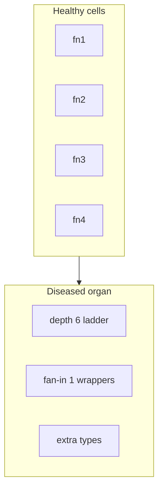

*Caption: **Healthy cells, diseased organ.***

> **DEFINITION — M1**
> Passing every function gate does not imply a mergeable service.

---

## 11. Threshold Lab tutorial

### Method (not magic numbers)

1. Measure 3–5 real PRs **or** the Shopapi S1/S2 pair.
2. Mark each design “would merge” / “would reject” by **human taste first**.
3. Set limits just tight enough to **reject S1** and **accept S2**.
4. Run **warn-only for 2 weeks**.
5. Allowlist generated code, migrations, lockfiles, large match tables.
6. Revisit when a limit starts **forcing worse designs**.

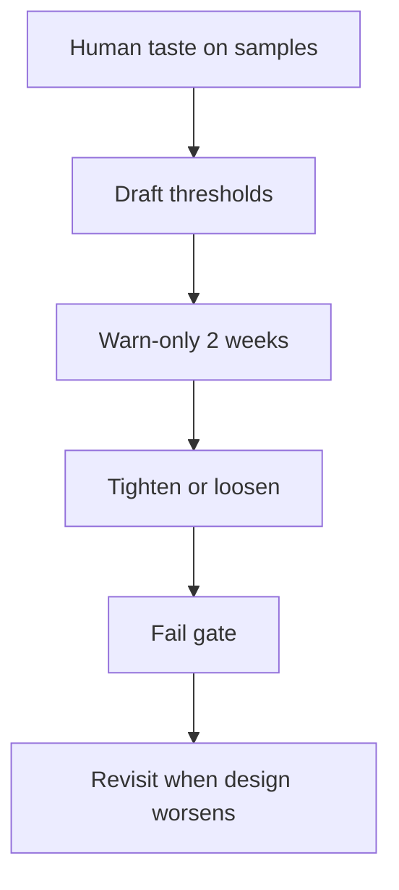

*Notice: taste first, numbers second. Metrics encode taste; they do not invent it.*

### Worked lab — depth ≤ 3 and fan-in ≥ 2

| Sample | Human verdict | Max depth | FI1 privates |
| --- | --- | ---: | ---: |
| S1 | reject | 6 | 8 |
| S2 | merge | 2 | 0 |

**Arrive at:** fail depth > 3; fail new private fan-in = 1 with body ≤ 4 statements. These two rules reject S1 and accept S2 without punishing `place_order`’s higher cognitive score.

### Starter bands

| Metric | Start-here fail | Warn | Notes |
| --- | --- | --- | --- |
| Cognitive / function | >15 (Sonar) or team 8–10 | 8–15 | Calls are free |
| Cyclomatic / function | >10–15 | 8–10 | Match/elif can look high; OK |
| Nesting | >4 | ≥3 | |
| File tokens | >4k | 2.5k | Exclude generated |
| File SLOC | >400–500 | 250 | |
| New private fan-in | =1 and body ≤4 statements | =1 | Unless public entry |
| Fan-out | >8 (no stdlib) | 6–8 | |
| Depth from entry | >3 | =3 | Primary |
| ΔE/ΔV | >2.5 **and** many FI1 | >2 + FI1 | Secondary — see S2 |
| New cycles | >0 | | Primary |
| New types / PR | >1 unless domain has concept | | |
| Affected tests | 0 on behavior change | | Primary |

### Metric conflict resolution

| Situation | Prefer | Action |
| --- | --- | --- |
| Local cognitive rose, graph improved | graph | usually merge |
| Graph “improved” via Protocol + one impl | reject ceremony | delete Protocol |
| Cyclo high from flat match | allow | do not extract 12 fns |
| File over token cap — data table | allow | allowlist |
| Fan-out high on composition root | allowlist symbol | do not fake-layer |

### If two designs pass, pick…

1. Fewer new symbols
2. Fewer files
3. Shallower depth
4. Names that are domain nouns/verbs
5. Tests through the public API

---

## 12. Putting gates in CI

### Realistic gate (teach, don’t dump a fragile script)

1. `index` HEAD (CodeGraph or equivalent).
2. List symbols in **changed files**.
3. For each new/changed symbol: `callers`, `callees`, `impact --depth 3`.
4. Rules: new private nodes with fan-in 1 + tiny body → fail; depth from public entry > 3 → fail; new cycles → fail.
5. `affected` tests: behavior change with 0 affected tests → fail or strong warn.
6. Roll out **warn vs fail**.
7. **Pair with Ruff / complexipy / radon — do not replace them.**

> **DO THIS**
> Local complexity linters + PR subgraph graph rules. Halstead/mutmut remain separate quality signals; they do not catch helper farms.

---

## 13. Review checklist (90 seconds)

1. Public entry: can I name the workflow in one sentence?
2. Depth from entry ≤ 3?
3. Any new private fan-in 1 wrappers? Inline or justify.
4. Flat match / elif table? Allow high cyclo.
5. New `*Factory` / `*Manager` / single-impl Protocol? Push back.
6. Behavior change: which tests move?
7. Did cognitive rise on the real function while the ladder died? Good.
8. File split: cohesive modules or 30-line confetti?

---

## 14. Agent / LLM prompt snippet

```text
Before extracting helpers, check fan-in. Do not add private functions with fan-in 1
and body ≤ 4 statements. Keep call depth from the public entry ≤ 3.
Prefer raising cognitive complexity on the public workflow over a ladder of wrappers.
Do not add Protocol/ABC/Factory/Manager for a single implementation.
Flat match/elif tables may have high cyclomatic complexity; do not split them
into one-line functions. Pair local complexity caps with call-graph checks on the PR.
Tests must exercise the public API, not only mocks of private helpers.
```

---

## Field cards

### Complexity

See [Field card — Complexity family](#field-card--complexity-family).

### Size

See [Field card — Size family](#field-card--size-family).

### Graph nodes

See [Field card — Graph node family](#field-card--graph-node-family).

### Diff / architecture

See [Field card — Diff / architecture family](#field-card--diff--architecture-family).

---

## Glossary

| Term | Meaning |
| --- | --- |
| Slop | Locally green code that makes a stinky module/service |
| Cyclomatic complexity | Independent path count (test budget) |
| Cognitive complexity | Read-cost score; calls are free; nesting costs |
| Fan-in / fan-out | Callers / callees on the chosen graph |
| Depth from entry | Hops from public API/entrypoint |
| ΔV / ΔE | Node / edge churn on PR subgraph |
| Henry–Kafura IFC | length × (fan-in × fan-out)² |
| Ceremony | Fake layer or type that adds names without reuse |
| Composition root | Legitimate high fan-out hub (main, router) |
| PR subgraph | Graph induced by changed symbols + near neighbors |
| Metric theater | Gates that look strict but train worse designs |
| LLM-edit budget | Practical file size for reliable model edits |
| Isolate | Degree-zero node (often dead) |
| SCC | Strongly connected component (cycle cluster) |

---

## Index of examples

| ID | Topic |
| --- | --- |
| F1 | Nested ifs vs early returns |
| F2 | Flat HTTP match — high cyclo, low cognitive |
| F3 | One-use `is_active_user` wrapper |
| F4 | Guard list vs nested same checks |
| F5 | Inlining S1 wrappers — local worse, module better |
| F6 | `parse_money` fan-in 3 worth extracting |
| F7 | Helpful file split vs slop split |
| S1 | Shopapi helper ladder |
| S2 | Shopapi balanced `place_order` |
| M1 | Healthy cells, diseased organ |

---

## machine-readable-thresholds.yaml

Source of truth: [`docs/guides/machine-readable-thresholds.yaml`](machine-readable-thresholds.yaml). The scorer's constants are pinned to it by `tests/test_metrics_against_slop.py::test_constants_match_yaml`.

---

## Deviation policy (for implementers of gates)

- If a limit forces worse designs, loosen the limit — do not add a fake layer to satisfy it.
- If docs/tools contradict this manual on a formula, trust the primary paper/tool docs and update the YAML notes.
- Low-risk local judgment: choose the conservative merge (shallower depth, fewer symbols), log it.
- Architecture / security / data-migration changes: stop and ask.

---

**End of manual.** Print the field cards. Calibrate on S1/S2. Pair graph gates with Ruff — never replace them.
