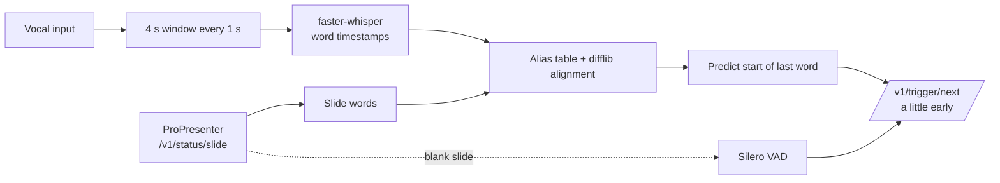

# verse-cue Implementation Plan

> **For agentic workers:** REQUIRED SUB-SKILL: Use superpowers:subagent-driven-development (recommended) or superpowers:executing-plans to implement this plan task-by-task. Steps use checkbox (`- [ ]`) syntax for tracking.

**Goal:** Auto-advance ProPresenter lyric slides from a live vocal feed: transcribe with faster-whisper, align the transcript to the current slide text, predict when the last word starts, fire `/v1/trigger/next` slightly early.

**Architecture:** Two production Python files. `verse_cue.py` is the runtime loop (`run(frames, pp, model, cfg, wait)`) with a duck-typed ProPresenter client and an audio-frame iterator. `harvest.py` is the offline tool (`download | aliases | bench | graphs`) that reuses `verse_cue.run` against a `FakePP` built from lrclib synced lyrics, so production, bench, and tests exercise the same loop.

**Tech Stack:** Python 3.12, `faster-whisper>=1.2.1` (CTranslate2; bundles Silero VAD via onnxruntime), `sounddevice`, `numpy`, stdlib (`tomllib`, `urllib`, `difflib`, `json`, `wave`, `subprocess`). Tool: `yt-dlp` (+ system `ffmpeg`). Dev: `pytest`, `pytest-xdist`, `pytest-cov`, `ruff`, `radon`, `complexipy`, `matplotlib`. Packaging: `uv` + `hatchling`.

**Spec:** `docs/superpowers/specs/2026-09-14-verse-cue-design.md` — read it first. The plan implements it; where the plan is more specific, the plan wins.

**Verified before hand-off:** the code and test blocks in this plan were assembled verbatim into a scratch project and run: 82 tests passed (1 online test skipped), coverage 99%, radon cyclomatic grade A on every function (average 3.0), MI grade A, complexipy clean, `ruff check --select ALL` clean with the ignore list below after `ruff format`. SLOC by radon: `verse_cue.py` 213, `harvest.py` 294. If a step's test fails for you, the first suspect is a transcription error from the plan, not the design.

## Global Constraints

Every task inherits these. Check them before every commit.

- Exactly two production files: `verse_cue.py`, `harvest.py`, both at repo root. No `app/`, no packages, no third module.
- Total production SLOC (both files, non-blank non-comment) **<= 1000**. Target ~250 + ~330. `tests/test_structure.py` enforces the cap.
- Radon gate (`scripts/check_radon_gates.py`, run in pre-commit and CI): **every function/method cyclomatic complexity <= 5 (grade A)**, average <= 5.0, maintainability index grade A, **<= 450 SLOC per file**. Radon counts each `if`/`elif`/`for`/`while`/`except`/ternary/`and`/`or`/comprehension-`for`/comprehension-`if` as +1. The code blocks in this plan were written to that budget; if you change one, re-count.
- Call depth from `main` **<= 3** within each module (`main -> a -> b -> c`; `c` may not call another in-module function). Calls into the other module (`vc.run`, `vc.transcribe`) and into libraries are leaves. `tests/test_structure.py` enforces this.
- No class or function names matching `*Factory`, `*Manager`, `Base*`. No abstract base classes or Protocols. No private helper (`_name`) with fan-in 1 and <= 4 statements — make it public or inline it.
- Functions <= 60 lines, <= 5 parameters, <= 4 returns.
- Runtime dependencies: `faster-whisper`, `sounddevice`, `numpy`. Nothing else outside the standard library in `verse_cue.py`. `harvest.py` may additionally shell out to `yt-dlp` and lazily import `matplotlib`.
- Tests: the only allowed test command is **`uv run pytest`** (full suite, `-n auto`, coverage from `pyproject.toml`). Never pass paths, `-k`, `-x`, `-n0`, or `-o addopts=`. Coverage fail-under 85.
- Lint: `uv run ruff check .` and `uv run ruff format --check .` clean before every commit.
- Git: stay on `main`, commit after every task, `git push origin main` after every task. No branches, no PRs.
- `pyproject.toml` is protected by a Cursor hook; editing it prompts the user for approval. That is expected in Task 1 — wait for approval, do not work around the hook.
- Never attribute an AI model inside `verse_cue.py`, `harvest.py`, `README.md` body, or the video. `docs/COST.md` is the only place that names models.
- Model names in TOML are exactly what `faster_whisper.WhisperModel` accepts: `tiny.en`, `base.en`, `small.en`, `distil-large-v3`, `large-v3-turbo`, or a Hugging Face CTranslate2 repo id.
- Repo: `github.com/AustinDKB/verse-cue` (public, MIT). The old `/home/austin/Desktop/PP AutoV2` is reference-only; import nothing from it.

## File Map

| Path | Responsibility | Task |
|---|---|---|
| `pyproject.toml` | project metadata, deps, pytest/ruff/coverage/complexipy config, hatch build incl. `verse-cue.toml` | 1 |
| `verse-cue.toml` | the one config file (also the bundled default) | 1 |
| `songs.txt` | 100 `Artist - Title` lines for harvest | 1 |
| `.pre-commit-config.yaml`, `.github/workflows/ci.yml` | gates | 1 |
| `scripts/check_radon_gates.py` | existing gate, repointed at the two files | 1 |
| `tests/conftest.py` | `ScriptedModel`, `ScriptedPP`, `make_cfg`, `silent_frames` | 1 |
| `tests/test_structure.py` | SLOC cap, call depth, forbidden names | 1 |
| `verse_cue.py` | runtime | 2–8 |
| `tests/test_config.py`, `test_text.py`, `test_align.py`, `test_window.py`, `test_pp.py`, `test_run.py`, `test_cli.py` | runtime tests | 2–8 |
| `harvest.py` | download / aliases / bench / graphs | 9–13 |
| `tests/test_download.py`, `test_lrc.py`, `test_aliases.py`, `test_bench.py`, `test_graphs.py` | tool tests | 9–13 |
| `tests/test_online.py` | real `tiny.en` smoke, skipped offline | 14 |
| `docs/metrics/*` | bench outputs | 14 |
| `README.md`, `docs/ORIGINAL-PLAN.md`, `docs/COST.md`, `docs/posts.md` | publishing | 15 |
| `media/` | HyperFrames explainer | 16 |

---

### Task 1: Scaffold, gates, config, test harness

**Files:**
- Create: `pyproject.toml`, `verse-cue.toml`, `songs.txt`, `.pre-commit-config.yaml`, `.github/workflows/ci.yml`, `tests/__init__.py` (empty), `tests/conftest.py`, `tests/test_structure.py`, `verse_cue.py` (stub), `harvest.py` (stub)
- Modify: `scripts/check_radon_gates.py:24-31,70,98,125,175-176`, `.gitignore`

**Interfaces:**
- Produces: `tests.conftest.ScriptedModel(windows)`, `ScriptedPP(slides)`, `make_cfg(tmp_path)`, `silent_frames(t_ends, hop_s)`, constants `D` (decide cfg) and `M` (model cfg) used by every later test.

- [ ] **Step 1: Write `pyproject.toml`** (the hook will ask the user to approve — wait for it)

```toml
[project]
name = "verse-cue"
version = "0.1.0"
description = "Auto-advance ProPresenter lyric slides from a live vocal feed"
readme = "README.md"
license = "MIT"
requires-python = ">=3.12"
dependencies = ["faster-whisper>=1.2.1", "sounddevice>=0.5", "numpy>=1.26"]

[project.optional-dependencies]
cuda = ["nvidia-cublas-cu12", "nvidia-cudnn-cu12>=9"]

[project.scripts]
verse-cue = "verse_cue:main"
verse-cue-harvest = "harvest:main"

[project.urls]
Homepage = "https://github.com/AustinDKB/verse-cue"

[dependency-groups]
dev = [
    "pytest>=8.3",
    "pytest-xdist>=3.8",
    "pytest-cov>=7",
    "ruff>=0.16",
    "radon>=6",
    "complexipy>=6",
    "matplotlib>=3.9",
    "yt-dlp>=2025.1.1",
    "pre-commit>=4",
]

[build-system]
requires = ["hatchling"]
build-backend = "hatchling.build"

[tool.hatch.build.targets.wheel]
only-include = ["verse_cue.py", "harvest.py", "verse-cue.toml"]

[tool.hatch.build.targets.sdist]
include = ["verse_cue.py", "harvest.py", "verse-cue.toml", "songs.txt", "README.md", "LICENSE"]

[tool.pytest.ini_options]
testpaths = ["tests"]
pythonpath = ["."]
addopts = [
    "-ra",
    "--strict-markers",
    "--strict-config",
    "-n",
    "auto",
    "--cov=verse_cue",
    "--cov=harvest",
    "--cov-report=term-missing",
    "--cov-fail-under=85",
]
markers = ["online: needs network and a model download (set VERSE_CUE_ONLINE=1)"]

[tool.coverage.run]
branch = true

[tool.coverage.report]
show_missing = true
exclude_also = ["if __name__ == .__main__.:", "pragma: no cover"]

[tool.ruff]
target-version = "py312"
line-length = 120

[tool.ruff.lint]
select = ["ALL"]
ignore = [
    "D",        # docstrings are written where they help, not everywhere
    "ANN",      # type hints where they help; radon/complexipy are the gates
    "T201",     # print is the CLI's output
    "S603", "S607", "S310",  # subprocess (yt-dlp, nvidia-smi) and http urlopen are the job
    "PLR2004",  # thresholds live in TOML; the few literals left are documented
    "PLC0415",  # lazy imports keep startup fast and optional deps optional
    "INP001",   # top-level scripts, not a package
    "COM812", "ISC001",  # formatter owns these
    "EM101", "EM102", "TRY003", "TRY300",  # short exception messages inline; return-in-try is fine at cc<=5
    "A003",     # pp.next() mirrors ProPresenter's /trigger/next
    "ICN001",   # `import matplotlib` (for matplotlib.use) has no conventional alias worth enforcing
    "CPY",      # no per-file copyright banner; LICENSE covers the repo
]

[tool.ruff.lint.per-file-ignores]
"tests/*" = ["S101", "PLR2004", "ARG", "SLF001", "FBT", "E501", "PTH"]

[tool.complexipy]
paths = ["verse_cue.py", "harvest.py"]
max-complexity-allowed = 10
failed = true
```

- [ ] **Step 2: Write `verse-cue.toml`** (bundled default; `--setup` copies it to the working directory)

```toml
# verse-cue configuration. Everything the runtime and the harvest tool read lives here.
# verse-cue.auto.toml (written by `verse-cue-harvest bench`) overrides [model] when present.

[propresenter]
host = "127.0.0.1"
port = 1025

[audio]
device = ""            # substring of the input device name; set by `verse-cue --setup`
sample_rate = 16000

[model]
name = ""              # "" -> chosen from [hardware]; else a faster-whisper model id
compute_type = "auto"
window_s = 4.0         # seconds of audio per transcription
hop_s = 1.0            # seconds between transcriptions; must be >= window_s / RTF
beam_size = 1
prompt_mode = "none"   # none | slide | hotwords  (bias the decoder with the slide text)

[decide]
lead_s = 0.3           # fire this many seconds before the predicted start of the last word
guard_s = 0.3          # ignore words heard within this many seconds of entering a slide (bleed)
default_sec_per_word = 0.45
rate_bounds = [0.15, 1.5]  # clamp for the measured seconds-per-word
min_matched = 4        # fewer matched words than min(this, ceil(n/2)) never fires
fuzzy_cutoff = 0.8     # difflib ratio for words not in the alias table

[blank]
min_speech_ms = 300
blank_settle_s = 1.0   # ignore voice this long after entering a blank slide

[hardware]
# VRAM GB threshold -> [threshold, model, compute_type]; first row whose threshold <= VRAM wins.
gpu = [[8, "large-v3-turbo", "float16"], [4, "distil-large-v3", "int8_float16"], [0, "small.en", "int8"]]
cpu = ["small.en", "int8"]

[alias]
model = "tiny.en"
temperatures = [0.6, 1.0]
min_count = 2
max_per_word = 20

[bench]
models = ["tiny.en", "base.en", "small.en", "distil-large-v3", "large-v3-turbo"]
window_s = [3.0, 4.0, 5.0]
hop_s = [0.5, 1.0]
prompt_mode = ["none", "slide", "hotwords"]
songs = 5
lines_per_slide = 2
blank_gap_s = 8.0
min_rtf = 4.0
max_false_pct = 5.0
```

- [ ] **Step 3: Write `songs.txt`** (one `Artist - Title` per line; the separator is ` - ` with spaces)

```text
Hillsong Worship - What A Beautiful Name
Bethel Music - Goodness of God
Elevation Worship - Graves Into Gardens
Chris Tomlin - How Great Is Our God
Hillsong UNITED - Oceans (Where Feet May Fail)
Phil Wickham - Living Hope
Cody Carnes - Firm Foundation (He Won't)
Maverick City Music - Jireh
Elevation Worship - O Come to the Altar
Hillsong Worship - King of Kings
Bethel Music - Raise a Hallelujah
Chris Tomlin - Good Good Father
Matt Redman - 10,000 Reasons (Bless the Lord)
Hillsong Worship - Who You Say I Am
Elevation Worship - Resurrecting
Phil Wickham - This Is Amazing Grace
Chris Tomlin - Amazing Grace (My Chains Are Gone)
Hillsong UNITED - So Will I (100 Billion X)
Cory Asbury - Reckless Love
Elevation Worship - The Blessing
Hillsong Worship - Cornerstone
Matt Redman - Blessed Be Your Name
Chris Tomlin - Our God
Passion - Glorious Day
Hillsong Worship - Mighty to Save
Kari Jobe - Revelation Song
Hillsong UNITED - Hosanna
Elevation Worship - Do It Again
Bethel Music - No Longer Slaves
Phil Wickham - Battle Belongs
Brandon Lake - Gratitude
Maverick City Music - Promises
Elevation Worship - Same God
Chris Tomlin - Holy Forever
Paul Baloche - Hosanna (Praise Is Rising)
Paul Baloche - Open the Eyes of My Heart
Chris Tomlin - Whom Shall I Fear (God of Angel Armies)
Matt Redman - The Heart of Worship
Rich Mullins - Awesome God
Hillsong UNITED - Lead Me to the Cross
Hillsong Worship - Shout to the Lord
Chris Tomlin - Forever
Chris Tomlin - Jesus Messiah
Chris Tomlin - Indescribable
Casting Crowns - Nobody
MercyMe - I Can Only Imagine
Lauren Daigle - You Say
Hillsong Worship - Broken Vessels (Amazing Grace)
Hillsong Young & Free - Alive
Jesus Culture - Your Love Never Fails
Bethel Music - Ever Be
Bethel Music - You Make Me Brave
Vertical Worship - Yes I Will
Elevation Worship - Here Again
Elevation Worship - Rattle!
Elevation Worship - Praise
Hillsong Worship - Man of Sorrows
Hillsong Worship - This I Believe (The Creed)
Hillsong Worship - Christ Is Enough
Hillsong UNITED - Touch the Sky
Hillsong UNITED - From the Inside Out
Chris Rice - Come Thou Fount of Every Blessing
Kristian Stanfill - One Thing Remains
Kristian Stanfill - Jesus Paid It All
Matt Maher - Lord, I Need You
Matt Maher - Because He Lives (Amen)
Matt Maher - Your Grace Is Enough
Meredith Andrews - Open Up the Heavens
Michael W. Smith - Agnus Dei
Michael W. Smith - Above All
Delirious? - I Could Sing of Your Love Forever
Hillsong Worship - I Surrender
Hillsong Worship - Touch of Heaven
Hillsong Worship - New Wine
Bethel Music - Champion
Big Daddy Weave - The Lion and the Lamb
Big Daddy Weave - Redeemed
Crowder - Come As You Are
Crowder - Lift Your Head Weary Sinner (Chains)
All Sons & Daughters - Great Are You Lord
Housefires - Build My Life
Pat Barrett - Better
Zach Williams - Chain Breaker
Zach Williams - Old Church Choir
Elevation Worship - Trust In God
Maverick City Music - Man of Your Word
Maverick City Music - Refiner
Brandon Lake - Too Good to Not Believe
Phil Wickham - House of the Lord
Phil Wickham - Hymn of Heaven
Phil Wickham - Great Things
Chris Tomlin - I Will Follow
Chris Tomlin - We Fall Down
Chris Tomlin - The Wonderful Cross
Matt Redman - Once Again
Newsboys - We Believe
Hillsong Worship - Behold (Then Sings My Soul)
Hillsong Worship - O Praise the Name (Anastasis)
Hillsong UNITED - Good Grace
Shane & Shane - Though You Slay Me
CityAlight - Yet Not I But Through Christ in Me
Sovereign Grace Music - His Mercy Is More
Keith & Kristyn Getty - In Christ Alone
Stuart Townend - How Deep the Father's Love for Us
Sinach - Way Maker
Israel Houghton - You Are Good
Kari Jobe - The More I Seek You
Jeremy Camp - Same Power
Hillsong Worship - Alive in Us
Hillsong Worship - Grace to Grace
```

- [ ] **Step 4: Repoint `scripts/check_radon_gates.py` at the two files**

Replace lines 24–31:

```python
SOURCES = [ROOT / "verse_cue.py", ROOT / "harvest.py"]
TESTS = ROOT / "tests"
SLOC_PATHS = [*SOURCES, TESTS]

# Radon A rank is complexity 1-5. Strict average gate requires grade A and score <= 5.
MAX_AVERAGE_SCORE = 5.0
MAX_SLOC_PER_FILE = 450  # docs/guides/machine-readable-thresholds.yaml size.file_sloc.fail_gt
```

Replace each of the three `str(APP),` list items (in `check_cyclomatic` twice, `check_maintainability` once) with `*map(str, SOURCES),`.

Replace in `main()`:

```python
    missing = [str(p) for p in SOURCES if not p.exists()]
    if missing:
        _fail(f"Missing source files: {missing}")
```

Update the module docstring line 9 to `- Raw SLOC: fail any file with SLOC above MAX_SLOC_PER_FILE (450)`.

- [ ] **Step 5: Write `.pre-commit-config.yaml`**

```yaml
default_language_version:
  python: python3.12

repos:
  - repo: https://github.com/astral-sh/ruff-pre-commit
    rev: v0.16.1
    hooks:
      - id: ruff-check
        args: [--fix]
      - id: ruff-format

  - repo: local
    hooks:
      - id: radon-gates
        name: radon gates (cc A per block, mi A, sloc <= 450)
        entry: uv run python scripts/check_radon_gates.py
        language: system
        pass_filenames: false
        types: [python]

      - id: complexipy
        name: complexipy (cognitive <= 10)
        entry: uv run complexipy
        language: system
        pass_filenames: false
        types: [python]

      - id: pytest
        name: uv run pytest (full suite, parallel, coverage)
        entry: uv run pytest
        language: system
        pass_filenames: false
        stages: [pre-push]
```

- [ ] **Step 6: Write `.github/workflows/ci.yml`**

```yaml
name: ci
on:
  push:
    branches: [main]
  pull_request:
jobs:
  test:
    runs-on: ubuntu-latest
    steps:
      - uses: actions/checkout@v4
      - uses: astral-sh/setup-uv@v5
      - run: sudo apt-get update && sudo apt-get install -y libportaudio2 ffmpeg
      - run: uv sync --group dev
      - run: uv run ruff check . && uv run ruff format --check .
      - run: uv run python scripts/check_radon_gates.py
      - run: uv run complexipy
      - run: uv run pytest
```

- [ ] **Step 7: Append to `.gitignore`**

```text
docs/metrics/bench.json
*.wav
```

- [ ] **Step 8: Write the two module stubs** (so imports resolve; real code lands in later tasks)

`verse_cue.py`:

```python
"""verse-cue: auto-advance ProPresenter lyric slides from a live vocal feed."""

from __future__ import annotations


def main(argv: list[str] | None = None) -> None:  # pragma: no cover - stub, replaced in Task 8
    """Entry point; filled in by later tasks."""
    raise SystemExit("verse-cue is not built yet")


if __name__ == "__main__":
    main()
```

`harvest.py`:

```python
"""verse-cue-harvest: download songs and lyrics, mine Whisper mis-hearings, bench configurations."""

from __future__ import annotations


def main(argv: list[str] | None = None) -> None:  # pragma: no cover - stub, replaced in Task 13
    """Entry point; filled in by later tasks."""
    raise SystemExit("harvest is not built yet")


if __name__ == "__main__":
    main()
```

- [ ] **Step 9: Write `tests/conftest.py`**

```python
"""Shared fakes. No model downloads, no network, no audio hardware."""

from __future__ import annotations

import shutil
from pathlib import Path
from types import SimpleNamespace

import numpy as np
import pytest

import verse_cue as vc

REPO = Path(__file__).resolve().parents[1]

D = {
    "lead_s": 0.3,
    "guard_s": 0.3,
    "default_sec_per_word": 0.45,
    "rate_bounds": [0.15, 1.5],
    "min_matched": 4,
    "fuzzy_cutoff": 0.8,
}
M = {"name": "tiny.en", "compute_type": "int8", "window_s": 4.0, "hop_s": 1.0, "beam_size": 1, "prompt_mode": "none"}


class ScriptedModel:
    """Fake WhisperModel. Each transcribe() returns the next scripted window: [(start, end, word), ...]."""

    def __init__(self, windows):
        self.windows = list(windows)
        self.calls: list[dict] = []

    def transcribe(self, audio, **kw):
        self.calls.append(kw)
        words = self.windows.pop(0) if self.windows else []
        segment = SimpleNamespace(words=[SimpleNamespace(start=s, end=e, word=w, probability=1.0) for s, e, w in words])
        return iter([segment]), None


class ScriptedPP:
    """Fake ProPresenter: a list of (uuid, text); next() advances; set(i) simulates the operator."""

    def __init__(self, slides):
        self.slides = list(slides)
        self.i = 0
        self.fires: list[float] = []
        self.reads = 0

    def slide(self):
        self.reads += 1
        return self.slides[self.i] if self.i < len(self.slides) else ("", "")

    def next(self, at):
        self.fires.append(at)
        self.i += 1

    def set(self, i):
        self.i = i


def silent_frames(t_ends, hop_s=1.0):
    """Yield (t_end, zeros) frames like the microphone would."""
    for t in t_ends:
        yield t, np.zeros(int(hop_s * vc.SR), dtype=np.float32)


@pytest.fixture
def cfg(tmp_path):
    """The bundled default config, with aliases empty and metrics redirected to tmp."""
    c = vc.load_config(REPO / "verse-cue.toml", tmp_path / "none.toml")
    c["aliases"] = {}
    c["metrics_file"] = str(tmp_path / "metrics.jsonl")
    return c


@pytest.fixture
def workdir(tmp_path, monkeypatch):
    """A working directory holding a copy of the default config."""
    shutil.copy(REPO / "verse-cue.toml", tmp_path / "verse-cue.toml")
    monkeypatch.chdir(tmp_path)
    return tmp_path
```

- [ ] **Step 10: Write `tests/test_structure.py`**

```python
"""Anti-slop structure gates the radon script cannot express: total SLOC, call depth, ceremony names."""

from __future__ import annotations

import ast
import re
from pathlib import Path

import pytest

REPO = Path(__file__).resolve().parents[1]
MODULES = ["verse_cue.py", "harvest.py"]
FORBIDDEN = re.compile(r"(Factory|Manager)$|^Base[A-Z]")
MAX_TOTAL_SLOC = 1000
MAX_DEPTH = 3


def calls_by_function(tree: ast.Module) -> dict[str, set[str]]:
    graph = {}
    for node in tree.body:
        if isinstance(node, ast.FunctionDef):
            graph[node.name] = {
                n.func.id for n in ast.walk(node) if isinstance(n, ast.Call) and isinstance(n.func, ast.Name)
            }
    return graph


def depth(graph: dict[str, set[str]], name: str, seen: tuple = ()) -> int:
    if name in seen:
        return 0
    children = [c for c in graph.get(name, ()) if c in graph]
    return 1 + max((depth(graph, c, (*seen, name)) for c in children), default=0)


@pytest.mark.parametrize("path", MODULES)
def test_call_depth_from_main_at_most_3(path):
    graph = calls_by_function(ast.parse((REPO / path).read_text()))
    assert "main" in graph
    assert depth(graph, "main") - 1 <= MAX_DEPTH


@pytest.mark.parametrize("path", MODULES)
def test_no_ceremony_names(path):
    tree = ast.parse((REPO / path).read_text())
    names = [n.name for n in ast.walk(tree) if isinstance(n, (ast.ClassDef, ast.FunctionDef))]
    assert not [n for n in names if FORBIDDEN.search(n)]


def test_total_production_sloc_under_cap():
    total = 0
    for path in MODULES:
        lines = (REPO / path).read_text().splitlines()
        total += sum(1 for line in lines if line.strip() and not line.strip().startswith("#"))
    assert total <= MAX_TOTAL_SLOC
```

- [ ] **Step 11: Install, wire hooks, run everything**

Run: `uv sync --group dev && uv run pre-commit install --hook-type pre-commit --hook-type pre-push && uv run ruff check . && uv run ruff format . && uv run python scripts/check_radon_gates.py && uv run pytest`
Expected: ruff clean, radon `OK`, pytest 5 passed (2 parametrized structure tests x 2 modules + the SLOC cap), coverage 100% of the two stubs (the `raise` lines are excluded). If `pre-commit` complains that `ruff-pre-commit` rev `v0.16.1` does not exist, run `uv run pre-commit autoupdate` and commit the bumped rev.

- [ ] **Step 12: Commit and push**

```bash
git add -A
git commit -m "Scaffold verse-cue: pyproject, config, songs, gates, test harness"
git push origin main
```

---

### Task 2: Config loading and hardware model pick

**Files:**
- Modify: `verse_cue.py`
- Test: `tests/test_config.py`

**Interfaces:**
- Produces: `SR = 16000`, `CONFIG`, `AUTO`, `ALIASES`, `METRICS`, `DEFAULT_CONFIG` (Paths); `load_config(path=CONFIG, auto=AUTO) -> dict`; `gpu_gb() -> float`; `pick_model(hw: dict, gb: float) -> tuple[str, str]` (name, compute_type); `load_model(cfg) -> WhisperModel`.

- [ ] **Step 1: Write the failing tests**

```python
"""Config merge, bundled default fallback, hardware table."""

from types import SimpleNamespace

import verse_cue as vc


def test_load_config_merges_auto_over_model(tmp_path):
    main = tmp_path / "verse-cue.toml"
    main.write_text('[model]\nname = ""\nwindow_s = 4.0\n')
    auto = tmp_path / "verse-cue.auto.toml"
    auto.write_text('[model]\nname = "small.en"\n')
    assert vc.load_config(main, auto)["model"] == {"name": "small.en", "window_s": 4.0}


def test_load_config_falls_back_to_bundled_default(tmp_path):
    cfg = vc.load_config(tmp_path / "missing.toml", tmp_path / "none.toml")
    assert cfg["propresenter"]["port"] == 1025
    assert cfg["model"]["prompt_mode"] == "none"


def test_pick_model_walks_gpu_table_then_cpu():
    hw = {"gpu": [[8, "big", "float16"], [0, "small.en", "int8"]], "cpu": ["base.en", "int8"]}
    assert vc.pick_model(hw, 12.0) == ("big", "float16")
    assert vc.pick_model(hw, 3.9) == ("small.en", "int8")
    assert vc.pick_model(hw, 0.0) == ("base.en", "int8")


def test_gpu_gb_is_zero_without_nvidia_smi(monkeypatch):
    def boom(*_a, **_k):
        raise FileNotFoundError

    monkeypatch.setattr(vc.subprocess, "run", boom)
    assert vc.gpu_gb() == 0.0


def test_gpu_gb_parses_mebibytes(monkeypatch):
    monkeypatch.setattr(vc.subprocess, "run", lambda *_a, **_k: SimpleNamespace(stdout="12288\n"))
    assert vc.gpu_gb() == 12.0


def test_load_model_uses_table_when_name_empty(monkeypatch):
    seen = {}

    class FakeWhisper:
        def __init__(self, name, device, compute_type):
            seen.update(name=name, device=device, compute_type=compute_type)

    monkeypatch.setitem(__import__("sys").modules, "faster_whisper", SimpleNamespace(WhisperModel=FakeWhisper))
    monkeypatch.setattr(vc, "gpu_gb", lambda: 0.0)
    cfg = {"model": {"name": "", "compute_type": "auto"}, "hardware": {"gpu": [], "cpu": ["base.en", "int8"]}}
    vc.load_model(cfg)
    assert seen == {"name": "base.en", "device": "auto", "compute_type": "int8"}
```

- [ ] **Step 2: Run to verify failure**

Run: `uv run pytest`
Expected: FAIL — `AttributeError: module 'verse_cue' has no attribute 'load_config'` (and siblings).

- [ ] **Step 3: Implement** — replace the stub body of `verse_cue.py` above `main` with:

```python
"""verse-cue: auto-advance ProPresenter lyric slides from a live vocal feed.

One loop: listen -> transcribe the last few seconds -> align the words to the current
slide's text -> predict when the last word starts -> trigger the next slide a little early.
"""

from __future__ import annotations

import json
import math
import queue
import re
import subprocess
import sys
import time
import tomllib
import urllib.request
from collections import deque
from dataclasses import dataclass, field
from difflib import SequenceMatcher, get_close_matches
from pathlib import Path

import numpy as np

SR = 16000
CONFIG = Path("verse-cue.toml")
AUTO = Path("verse-cue.auto.toml")
ALIASES = Path("aliases.json")
METRICS = Path("metrics.jsonl")
DEFAULT_CONFIG = Path(__file__).with_name("verse-cue.toml")
WORD_RE = re.compile(r"[^a-z']+")


def load_config(path: Path = CONFIG, auto: Path = AUTO) -> dict:
    """Read the TOML (bundled default when absent); verse-cue.auto.toml overrides [model]."""
    cfg = tomllib.loads((path if path.exists() else DEFAULT_CONFIG).read_text())
    if auto.exists():
        cfg["model"].update(tomllib.loads(auto.read_text())["model"])
    return cfg


def gpu_gb() -> float:
    """Total VRAM in GB via nvidia-smi, 0.0 when there is no NVIDIA GPU."""
    cmd = ["nvidia-smi", "--query-gpu=memory.total", "--format=csv,noheader,nounits"]
    try:
        out = subprocess.run(cmd, capture_output=True, text=True, timeout=5, check=True).stdout
        return int(out.split()[0]) / 1024
    except (OSError, subprocess.SubprocessError, ValueError, IndexError):
        return 0.0


def pick_model(hw: dict, gb: float) -> tuple[str, str]:
    """(model name, compute_type) from the [hardware] table: first GPU row whose threshold fits, else CPU."""
    for threshold, name, compute_type in hw["gpu"]:
        if gb and gb >= threshold:
            return name, compute_type
    return tuple(hw["cpu"])


def load_model(cfg: dict):
    """faster-whisper model from [model], or from the hardware table when name is empty."""
    from faster_whisper import WhisperModel

    m = cfg["model"]
    name, compute_type = (m["name"], m["compute_type"]) if m["name"] else pick_model(cfg["hardware"], gpu_gb())
    return WhisperModel(name, device="auto", compute_type=compute_type)
```

Keep the existing `main` stub and `__main__` guard below it for now.

- [ ] **Step 4: Run tests**

Run: `uv run pytest`
Expected: PASS for all `test_config.py` tests; coverage stays >= 85 because every new function is exercised.

- [ ] **Step 5: Commit and push**

```bash
git add verse_cue.py tests/test_config.py
git commit -m "verse_cue: config loading, hardware table, model load"
git push origin main
```

---

### Task 3: Tokens, alias table, canonicalization

**Files:**
- Modify: `verse_cue.py`
- Test: `tests/test_text.py`

**Interfaces:**
- Produces: `tokens(text: str) -> list[str]`; `load_aliases(path=ALIASES) -> dict[str, str]` (alias -> canonical); `canon(heard: list[tuple[float, str]], vocab: set[str], aliases: dict[str, str], cutoff: float) -> list[tuple[float, str]]`. Word normalization is the module regex `WORD_RE` applied inline (no `norm` helper — it would push `transcribe` to call depth 4).

- [ ] **Step 1: Write the failing tests**

```python
"""Word normalization, alias inversion, canonicalization order: alias -> fuzzy -> passthrough."""

import json

import verse_cue as vc


def test_tokens_lowercases_strips_punctuation_keeps_apostrophes():
    text = "Hallelujah, Name above ALL Names!\n(He's) -- good"
    assert vc.tokens(text) == ["hallelujah", "name", "above", "all", "names", "he's", "good"]


def test_tokens_drops_empty_pieces():
    assert vc.tokens(" -- ... 10,000 ' ") == []


def test_load_aliases_inverts_and_highest_count_wins(tmp_path):
    p = tmp_path / "aliases.json"
    p.write_text(json.dumps({"hallelujah": {"halleluia": 3, "holy": 2}, "holy": {"wholly": 5}, "jesus": {"wholly": 1}}))
    inv = vc.load_aliases(p)
    assert inv["halleluia"] == "hallelujah"
    assert inv["wholly"] == "holy"
    assert "holy" not in inv  # a canonical word is never remapped


def test_load_aliases_missing_file_is_empty(tmp_path):
    assert vc.load_aliases(tmp_path / "nope.json") == {}


def test_canon_alias_then_fuzzy_then_passthrough():
    heard = [(0.0, "grays"), (0.5, "amazin"), (1.0, "xylophone"), (1.5, "grace")]
    out = vc.canon(heard, {"amazing", "grace"}, {"grays": "grace"}, 0.8)
    assert out == [(0.0, "grace"), (0.5, "amazing"), (1.0, "xylophone"), (1.5, "grace")]
```

- [ ] **Step 2: Run to verify failure**

Run: `uv run pytest`
Expected: FAIL — `AttributeError: module 'verse_cue' has no attribute 'tokens'`.

- [ ] **Step 3: Implement** — add after `load_model`:

```python
def tokens(text: str) -> list[str]:
    """Slide text -> lowercase words of letters and apostrophes; empties dropped."""
    return [w for w in WORD_RE.sub(" ", text.lower()).split() if w.strip("'")]


def load_aliases(path: Path = ALIASES) -> dict[str, str]:
    """Invert {canonical: {alias: count}} into {alias: canonical}; highest count wins; canonicals stay."""
    table = json.loads(path.read_text()) if path.exists() else {}
    best: dict[str, tuple[int, str]] = {}
    for canon, al in table.items():
        for alias, n in al.items():
            best[alias] = max(best.get(alias, (0, "")), (n, canon))
    return {alias: best[alias][1] for alias in best.keys() - table.keys()}


def canon(heard: list[tuple[float, str]], vocab: set[str], aliases: dict[str, str], cutoff: float) -> list:
    """Map heard words onto the slide vocabulary: alias table first, then difflib, else unchanged."""
    out = []
    for t, heard_word in heard:
        w = aliases.get(heard_word, heard_word)
        if w not in vocab:
            w = (get_close_matches(w, vocab, n=1, cutoff=cutoff) or [w])[0]
        out.append((t, w))
    return out
```

- [ ] **Step 4: Run tests**

Run: `uv run pytest`
Expected: PASS.

- [ ] **Step 5: Commit and push**

```bash
git add verse_cue.py tests/test_text.py
git commit -m "verse_cue: tokens, alias table inversion, canonicalization"
git push origin main
```

---

### Task 4: Alignment and prediction

**Files:**
- Modify: `verse_cue.py`
- Test: `tests/test_align.py`

**Interfaces:**
- Produces: `align(slide_words: list[str], heard: list[tuple[float, str]]) -> list[tuple[int, float]]` ((slide index, capture time) in slide order); `predict(pairs, n_words: int, d: dict) -> float | None`.

- [ ] **Step 1: Write the failing tests**

```python
"""Sequence alignment of heard words to slide words, and the fire-time prediction."""

import pytest

import verse_cue as vc
from tests.conftest import D

SLIDE = vc.tokens("Our God is an awesome God He reigns from heaven above")  # 11 words, idx 0..10


def test_align_maps_slide_index_to_capture_time_in_order():
    heard = [(1.0, "our"), (1.4, "god"), (1.8, "is"), (2.2, "an"), (2.6, "awesome")]
    assert vc.align(SLIDE, heard) == [(0, 1.0), (1, 1.4), (2, 1.8), (3, 2.2), (4, 2.6)]


def test_align_skips_garbage_and_places_repeated_word_by_context():
    heard = [(1.0, "uh"), (1.4, "god"), (1.8, "is"), (2.2, "an"), (2.6, "awesome"), (3.0, "god"), (3.4, "he")]
    assert [i for i, _ in vc.align(SLIDE, heard)] == [1, 2, 3, 4, 5, 6]


def test_align_nothing_heard():
    assert vc.align(SLIDE, []) == []


def test_predict_none_below_min_matched():
    assert vc.predict([(0, 1.0), (1, 1.4)], 11, D) is None


def test_predict_min_matched_shrinks_for_short_slides():
    # 3-word slide: min(4, ceil(3/2)=2) = 2 matched words is enough
    assert vc.predict([(0, 1.0), (1, 1.4)], 3, D) is not None


def test_predict_extrapolates_with_measured_rate():
    pairs = [(0, 1.0), (1, 1.4), (2, 1.8), (3, 2.2), (4, 2.6)]  # 0.4 s/word
    # last word is idx 10, six words after idx 4: 2.6 + 6*0.4 - lead 0.3
    assert vc.predict(pairs, 11, D) == pytest.approx(4.7)


def test_predict_uses_default_rate_when_span_too_short():
    d = {**D, "min_matched": 2}
    assert vc.predict([(8, 5.0), (9, 5.5)], 11, d) == pytest.approx(5.5 + 1 * 0.45 - 0.3)


def test_predict_clamps_absurd_rate():
    d = {**D, "min_matched": 3}
    pairs = [(0, 0.0), (1, 10.0), (2, 20.0)]  # 10 s/word -> clamped to 1.5
    assert vc.predict(pairs, 11, d) == pytest.approx(20.0 + 8 * 1.5 - 0.3)


def test_predict_last_word_heard_is_already_due():
    pairs = [(7, 1.0), (8, 1.4), (9, 1.8), (10, 2.2)]
    assert vc.predict(pairs, 11, D) <= 2.2
```

- [ ] **Step 2: Run to verify failure**

Run: `uv run pytest`
Expected: FAIL — `AttributeError: module 'verse_cue' has no attribute 'align'`.

- [ ] **Step 3: Implement** — add after `canon`:

```python
def align(slide_words: list[str], heard: list[tuple[float, str]]) -> list[tuple[int, float]]:
    """(slide index, capture time) for every heard word that lines up with the slide, in slide order."""
    matcher = SequenceMatcher(None, slide_words, [w for _, w in heard], autojunk=False)
    return [(i + k, heard[j + k][0]) for i, j, n in matcher.get_matching_blocks() for k in range(n)]


def predict(pairs: list[tuple[int, float]], n_words: int, d: dict) -> float | None:
    """Capture-clock time to fire: predicted start of the last word minus lead. None when evidence is thin."""
    if len(pairs) < min(d["min_matched"], math.ceil(n_words / 2)):
        return None
    (i0, t0), (i1, t1) = pairs[0], pairs[-1]
    rate = (t1 - t0) / (i1 - i0) if i1 - i0 >= 2 else d["default_sec_per_word"]
    lo, hi = d["rate_bounds"]
    return t1 + (n_words - 1 - i1) * min(max(rate, lo), hi) - d["lead_s"]
```

- [ ] **Step 4: Run tests**

Run: `uv run pytest`
Expected: PASS.

- [ ] **Step 5: Commit and push**

```bash
git add verse_cue.py tests/test_align.py
git commit -m "verse_cue: difflib alignment and last-word prediction"
git push origin main
```

---

### Task 5: Slide state, window transcription, merge

**Files:**
- Modify: `verse_cue.py`
- Test: `tests/test_window.py`

**Interfaces:**
- Produces: `@dataclass Slide(uuid="", words=[], committed=[], previous=[], entered=0.0, predicted=None, pairs=[])`; `transcribe(model, audio: np.ndarray, t_start: float, m: dict, prompt: str) -> tuple[list[tuple[float, str]], float]`; `merge(slide: Slide, latest, window_start: float, guard_until: float) -> list[tuple[float, str]]`.

- [ ] **Step 1: Write the failing tests**

```python
"""Per-window transcription mapped onto the capture clock, and the commit/latest-wins merge."""

import numpy as np

import verse_cue as vc
from tests.conftest import M, ScriptedModel


def test_transcribe_maps_word_starts_to_capture_clock_and_normalizes():
    model = ScriptedModel([[(0.2, 0.5, " Amazing,"), (0.6, 0.9, " Grace")]])
    words, infer = vc.transcribe(model, np.zeros(vc.SR, np.float32), 100.0, M, "")
    assert words == [(100.2, "amazing"), (100.6, "grace")]
    assert infer >= 0.0


def test_transcribe_passes_runtime_settings():
    model = ScriptedModel([[]])
    vc.transcribe(model, np.zeros(vc.SR, np.float32), 0.0, {**M, "beam_size": 3}, "")
    kw = model.calls[0]
    assert kw["beam_size"] == 3
    assert kw["word_timestamps"] is True
    assert kw["condition_on_previous_text"] is False
    assert kw["vad_filter"] is False
    assert kw["temperature"] == 0.0
    assert "initial_prompt" not in kw
    assert "hotwords" not in kw


def test_transcribe_prompt_modes():
    slide_mode = ScriptedModel([[]])
    vc.transcribe(slide_mode, np.zeros(vc.SR, np.float32), 0.0, {**M, "prompt_mode": "slide"}, "our god")
    assert slide_mode.calls[0]["initial_prompt"] == "our god"
    hot = ScriptedModel([[]])
    vc.transcribe(hot, np.zeros(vc.SR, np.float32), 0.0, {**M, "prompt_mode": "hotwords"}, "our god")
    assert hot.calls[0]["hotwords"] == "our god"


def test_transcribe_temperature_override_for_harvest():
    model = ScriptedModel([[]])
    vc.transcribe(model, np.zeros(vc.SR, np.float32), 0.0, {**M, "temperature": 1.0}, "")
    assert model.calls[0]["temperature"] == 1.0


def test_merge_commits_words_that_left_the_window_and_latest_wins():
    s = vc.Slide("u", ["a", "b"], entered=0.0)
    s.previous = [(0.5, "x"), (2.5, "y")]
    out = vc.merge(s, [(2.6, "y2"), (3.5, "z")], window_start=2.0, guard_until=0.0)
    assert s.committed == [(0.5, "x")]
    assert s.previous == [(2.6, "y2"), (3.5, "z")]
    assert out == [(0.5, "x"), (2.6, "y2"), (3.5, "z")]


def test_merge_drops_bleed_before_guard():
    s = vc.Slide("u", ["a"], entered=10.0)
    out = vc.merge(s, [(10.1, "held"), (10.9, "new")], window_start=8.0, guard_until=10.3)
    assert out == [(10.9, "new")]
```

- [ ] **Step 2: Run to verify failure**

Run: `uv run pytest`
Expected: FAIL — `AttributeError: module 'verse_cue' has no attribute 'transcribe'`.

- [ ] **Step 3: Implement** — add after `predict`:

```python
@dataclass
class Slide:
    """Everything we know about the slide currently on screen. Reset whenever the uuid changes."""

    uuid: str = ""
    words: list[str] = field(default_factory=list)
    committed: list[tuple[float, str]] = field(default_factory=list)
    previous: list[tuple[float, str]] = field(default_factory=list)
    entered: float = 0.0
    predicted: float | None = None
    pairs: list[tuple[int, float]] = field(default_factory=list)


def transcribe(model, audio: np.ndarray, t_start: float, m: dict, prompt: str) -> tuple[list, float]:
    """One window -> [(capture-clock word start, normalized word)], inference seconds."""
    kw = {"slide": {"initial_prompt": prompt}, "hotwords": {"hotwords": prompt}}.get(m["prompt_mode"], {})
    t0 = time.monotonic()
    segments, _ = model.transcribe(
        audio,
        language="en",
        beam_size=m["beam_size"],
        temperature=m.get("temperature", 0.0),
        word_timestamps=True,
        condition_on_previous_text=False,
        vad_filter=False,
        **kw,
    )
    words = [(t_start + w.start, WORD_RE.sub("", w.word.lower())) for s in segments for w in s.words or []]
    return words, time.monotonic() - t0


def merge(slide: Slide, latest: list, window_start: float, guard_until: float) -> list[tuple[float, str]]:
    """Commit previous-window words that fell out of the window; the latest window wins for its own region."""
    slide.committed += [w for w in slide.previous if w[0] < window_start]
    slide.previous = latest
    return [w for w in slide.committed + latest if w[0] >= guard_until]
```

- [ ] **Step 4: Run tests**

Run: `uv run pytest`
Expected: PASS.

- [ ] **Step 5: Commit and push**

```bash
git add verse_cue.py tests/test_window.py
git commit -m "verse_cue: Slide state, window transcription, latest-wins merge"
git push origin main
```

---

### Task 6: ProPresenter client and VAD

**Files:**
- Modify: `verse_cue.py`
- Test: `tests/test_pp.py`

**Interfaces:**
- Produces: `class ProPresenter(host, port)` with `.slide() -> tuple[str, str]` (uuid, text; `("", "")` when nothing is showing; last known value when unreachable) and `.next(at: float) -> None`; `speech_in(chunk: np.ndarray, blank: dict) -> bool`.

- [ ] **Step 1: Write the failing tests**

```python
"""HTTP client against ProPresenter's two endpoints, and the VAD gate."""

import json

import numpy as np

import verse_cue as vc


class FakeResponse:
    def __init__(self, body):
        self.body = body

    def read(self):
        return self.body

    def __enter__(self):
        return self

    def __exit__(self, *_exc):
        return False


def patch_urlopen(monkeypatch, bodies):
    """bodies: list of bytes or Exception instances, consumed in order. Returns the list of URLs hit."""
    urls = []

    def fake(url, timeout):
        urls.append((url, timeout))
        body = bodies.pop(0)
        if isinstance(body, Exception):
            raise body
        return FakeResponse(body)

    monkeypatch.setattr(vc.urllib.request, "urlopen", fake)
    return urls


def test_slide_reads_current_uuid_and_text(monkeypatch):
    body = json.dumps({"current": {"uuid": "A", "text": "Amazing grace", "notes": ""}, "next": None}).encode()
    urls = patch_urlopen(monkeypatch, [body])
    pp = vc.ProPresenter("127.0.0.1", 1025)
    assert pp.slide() == ("A", "Amazing grace")
    assert urls == [("http://127.0.0.1:1025/v1/status/slide", 1)]


def test_slide_null_current_means_no_slide(monkeypatch):
    patch_urlopen(monkeypatch, [json.dumps({"current": None, "next": None}).encode()])
    assert vc.ProPresenter("h", 1).slide() == ("", "")


def test_slide_unreachable_keeps_last_known_and_warns(monkeypatch, capsys):
    ok = json.dumps({"current": {"uuid": "A", "text": "x", "notes": ""}}).encode()
    patch_urlopen(monkeypatch, [ok, OSError("down"), b"not json"])
    pp = vc.ProPresenter("h", 1)
    assert pp.slide() == ("A", "x")
    assert pp.slide() == ("A", "x")
    assert pp.slide() == ("A", "x")
    assert "unreachable" in capsys.readouterr().err


def test_next_hits_trigger_endpoint(monkeypatch):
    urls = patch_urlopen(monkeypatch, [b"{}"])
    vc.ProPresenter("h", 2).next(at=1.0)
    assert urls[0][0] == "http://h:2/v1/trigger/next"


def test_next_survives_errors(monkeypatch, capsys):
    patch_urlopen(monkeypatch, [OSError("down")])
    vc.ProPresenter("h", 2).next(at=1.0)
    assert "trigger failed" in capsys.readouterr().err


def test_speech_in_silence_is_false():
    assert vc.speech_in(np.zeros(vc.SR, dtype=np.float32), {"min_speech_ms": 300}) is False
```

- [ ] **Step 2: Run to verify failure**

Run: `uv run pytest`
Expected: FAIL — `AttributeError: module 'verse_cue' has no attribute 'ProPresenter'`.

- [ ] **Step 3: Implement** — add after `merge`:

```python
def speech_in(chunk: np.ndarray, blank: dict) -> bool:
    """Silero VAD (bundled with faster-whisper): is there voice in this hop?"""
    from faster_whisper.vad import VadOptions, get_speech_timestamps

    opts = VadOptions(min_speech_duration_ms=blank["min_speech_ms"])
    return bool(get_speech_timestamps(chunk, opts, sampling_rate=SR))


class ProPresenter:
    """Two endpoints: read the current slide, trigger the next one. Never raises into the loop."""

    def __init__(self, host: str, port: int) -> None:
        self.base = f"http://{host}:{port}/v1"
        self.last: tuple[str, str] = ("", "")

    def get(self, path: str) -> bytes:
        with urllib.request.urlopen(self.base + path, timeout=1) as response:
            return response.read()

    def slide(self) -> tuple[str, str]:
        """(uuid, text). ('', '') when nothing is showing; last known value when unreachable."""
        try:
            current = json.loads(self.get("/status/slide"))["current"] or {"uuid": "", "text": ""}
            self.last = (current["uuid"], current["text"])
        except (OSError, ValueError, KeyError):
            print(f"verse-cue: ProPresenter unreachable at {self.base}", file=sys.stderr)
        return self.last

    def next(self, at: float) -> None:  # noqa: ARG002 - `at` is recorded by the bench fake, ignored live
        try:
            self.get("/trigger/next")
        except OSError:
            print("verse-cue: trigger failed", file=sys.stderr)
```

- [ ] **Step 4: Run tests**

Run: `uv run pytest`
Expected: PASS. (`test_speech_in_silence_is_false` loads the bundled Silero ONNX model once; ~1 s.)

- [ ] **Step 5: Commit and push**

```bash
git add verse_cue.py tests/test_pp.py
git commit -m "verse_cue: ProPresenter client and VAD gate"
git push origin main
```

---

### Task 7: The loop — `run`, `blank_tick`, `lyric_tick`, `decide`, `fire`, `log_metrics`

**Files:**
- Modify: `verse_cue.py`
- Test: `tests/test_run.py`

**Interfaces:**
- Consumes: everything from Tasks 2–6.
- Produces: `run(frames, pp, model, cfg, wait=sleep_until) -> None`; `sleep_until(t: float) -> None`; `blank_tick(slide, chunk, t_end, blank) -> float | None`; `lyric_tick(slide, ring, t_end, model, cfg) -> float | None`; `decide(slide, predicted, now, hop_s) -> float | None`; `fire(pp, slide, at, wait, cfg) -> None`; `log_metrics(slide, at, cfg) -> None`. `frames` yields `(t_end: float, chunk: np.ndarray)`. `cfg["aliases"]` must be set by the caller; `cfg.get("metrics_file", METRICS)` is the log path.

- [ ] **Step 1: Write the failing tests**

```python
"""End-to-end loop with scripted model and fake ProPresenter. Times are the capture clock (seconds)."""

import json
from pathlib import Path

import pytest

import verse_cue as vc
from tests.conftest import ScriptedModel, ScriptedPP, silent_frames

SLIDE = "Our God is an awesome God He reigns from heaven above"  # 11 words


def words_at(offsets_words):
    """[(offset_in_window, word)] -> scripted window [(start, end, word)]."""
    return [(o, o + 0.3, w) for o, w in offsets_words]


def run_with(windows, pp, cfg, t_ends):
    waits = []
    model = ScriptedModel(windows)
    vc.run(silent_frames(t_ends), pp, model, cfg, wait=waits.append)
    return model, waits


def test_fires_early_from_extrapolation(cfg):
    # window_s=4, hop_s=1. The 5th window (t_end=5, window start 1.0) hears the first five words at 0.4 s/word:
    # capture times 2.0, 2.4, 2.8, 3.2, 3.6 (all after the guard: entered 1.0 + guard_s 0.3).
    windows = [[]] * 4 + [words_at([(1.0, "our"), (1.4, "god"), (1.8, "is"), (2.2, "an"), (2.6, "awesome")])]
    pp = ScriptedPP([("A", SLIDE), ("B", "something completely different here")])
    _, waits = run_with(windows, pp, cfg, [1, 2, 3, 4, 5, 6, 7, 8])
    # predicted = 3.6 + 6*0.4 - lead 0.3 = 5.7; due because 5.7 <= now(5+) + hop 1; fire at max(5.7, now) = 5.7
    assert pp.fires == [pytest.approx(5.7)]
    assert waits == pp.fires


def test_identical_consecutive_slides_do_not_double_fire(cfg):
    tail = words_at([(2.0, "reigns"), (2.4, "from"), (2.8, "heaven"), (3.2, "above")])  # window t_end=5, start 1
    held = words_at([(3.5, "above")])  # window t_end=7, start 3 -> capture 6.5, one word only
    windows = [[]] * 4 + [tail, [], held, [], []]
    pp = ScriptedPP([("A", SLIDE), ("B", SLIDE), ("C", "x")])
    run_with(windows, pp, cfg, [1, 2, 3, 4, 5, 6, 7, 8, 9])
    assert len(pp.fires) == 1


def test_blank_slide_fires_on_voice_after_settle(cfg, monkeypatch):
    monkeypatch.setattr(vc, "speech_in", lambda chunk, blank: True)
    pp = ScriptedPP([("BL", ""), ("A", SLIDE)])
    run_with([[]] * 10, pp, cfg, [1, 2, 3, 4])
    # entered at t=1, blank_settle_s=1.0 -> first eligible tick is t=2
    assert pp.fires == [2]


def test_no_slide_showing_never_fires(cfg, monkeypatch):
    monkeypatch.setattr(vc, "speech_in", lambda chunk, blank: True)
    pp = ScriptedPP([("", "")])
    run_with([[]] * 10, pp, cfg, [1, 2, 3, 4, 5])
    assert pp.fires == []


def test_operator_change_during_inference_cancels_fire(cfg):
    class SwitchingPP(ScriptedPP):
        def slide(self):
            if self.reads == 5:  # the re-check inside fire() after the 5th window
                self.set(1)
            return super().slide()

    # window t_end=5 (start 1.0): the whole tail at captures 2.0..3.2 -> matched 4 -> would fire at ~5.0
    windows = [[]] * 4 + [words_at([(1.0, "reigns"), (1.4, "from"), (1.8, "heaven"), (2.2, "above")])]
    pp = SwitchingPP([("A", SLIDE), ("B", "other")])
    run_with(windows, pp, cfg, [1, 2, 3, 4, 5])
    assert pp.fires == []


def test_operator_change_resets_progress(cfg):
    # The operator jumps to slide B at t=4. Hearing slide A's tail afterwards must not fire;
    # hearing slide B's tail must.
    slide_b = "we will sing your praise forever and ever amen"  # 9 words -> min_matched = min(4, 5) = 4
    a_tail = words_at([(3.0, "reigns"), (3.4, "from"), (3.8, "heaven"), (4.2, "above")])  # window t=6, start 2
    b_tail = words_at([(2.0, "forever"), (2.4, "and"), (2.8, "ever"), (3.2, "amen")])  # window t=8, start 4
    windows = [[]] * 5 + [a_tail, [], b_tail, [], []]
    pp = ScriptedPP([("A", SLIDE), ("B", slide_b), ("C", "x")])

    def frames():
        for t in [1, 2, 3, 4, 5, 6, 7, 8, 9, 10]:
            if t == 4:
                pp.set(1)
            yield from silent_frames([t])

    vc.run(frames(), pp, ScriptedModel(windows), cfg, wait=lambda _t: None)
    # b_tail captures 6.0..7.2 -> predicted 7.2 - 0.3 = 6.9 -> fired at now ~= 8.0
    assert len(pp.fires) == 1
    assert pp.fires[0] == pytest.approx(8.0, abs=0.05)
    rows = [json.loads(line) for line in Path(cfg["metrics_file"]).read_text().splitlines()]
    assert [(r["event"], r["uuid"]) for r in rows] == [("enter", "A"), ("enter", "B"), ("fire", "B"), ("enter", "C")]


def test_metrics_log_has_enter_and_fire_rows(cfg):
    windows = [[]] * 4 + [words_at([(1.0, "reigns"), (1.4, "from"), (1.8, "heaven"), (2.2, "above")])]
    pp = ScriptedPP([("A", SLIDE), ("B", "other")])
    run_with(windows, pp, cfg, [1, 2, 3, 4, 5, 6])
    rows = [json.loads(line) for line in Path(cfg["metrics_file"]).read_text().splitlines()]
    events = [r["event"] for r in rows]
    assert events == ["enter", "fire", "enter"]
    fire = rows[1]
    assert fire["uuid"] == "A"
    assert fire["n_words"] == 11
    assert fire["matched"] == 4
    assert fire["idx_from_end"] == 0
    assert fire["window_s"] == 4.0


def test_sleep_until_does_not_sleep_for_the_past(monkeypatch):
    slept = []
    monkeypatch.setattr(vc.time, "sleep", slept.append)
    vc.sleep_until(vc.time.monotonic() - 10)
    assert slept == [0.0]
```

- [ ] **Step 2: Run to verify failure**

Run: `uv run pytest`
Expected: FAIL — `AttributeError: module 'verse_cue' has no attribute 'run'`.

- [ ] **Step 3: Implement** — add after `ProPresenter`:

```python
def sleep_until(t: float) -> None:
    time.sleep(max(0.0, t - time.monotonic()))


def log_metrics(slide: Slide, at: float | None, cfg: dict) -> None:
    """One JSON line per slide entered and per fire; operator overrides are derived offline from the gaps."""
    row = {
        "ts": time.time(),
        "event": "enter" if at is None else "fire",
        "uuid": slide.uuid,
        "n_words": len(slide.words),
        "matched": len(slide.pairs),
        "idx_from_end": len(slide.words) - 1 - slide.pairs[-1][0] if slide.pairs else None,
        "predicted": slide.predicted,
        "entered": slide.entered,
        "fired_at": at,
        "blank": not slide.words,
        **{k: cfg["model"][k] for k in ("name", "window_s", "hop_s", "prompt_mode")},
    }
    with Path(cfg.get("metrics_file", METRICS)).open("a") as f:
        f.write(json.dumps(row) + "\n")


def blank_tick(slide: Slide, chunk: np.ndarray, t_end: float, blank: dict) -> float | None:
    """Blank slide: advance on the first voice after the settle period. No slide at all: never."""
    if not slide.uuid:
        return None
    settled = t_end - slide.entered >= blank["blank_settle_s"]
    return t_end if settled and speech_in(chunk, blank) else None


def decide(slide: Slide, predicted: float | None, now: float, hop_s: float) -> float | None:
    """Keep the newest estimate; fire when it lands before the next tick would."""
    if predicted is not None:
        slide.predicted = predicted
    if slide.predicted is None or slide.predicted > now + hop_s:
        return None
    return max(slide.predicted, now)


def lyric_tick(slide: Slide, ring: deque, t_end: float, model, cfg: dict) -> float | None:
    """Transcribe the window, align to the slide, return the time to fire or None."""
    audio = np.concatenate(ring)
    start = t_end - len(audio) / SR
    latest, infer = transcribe(model, audio, start, cfg["model"], " ".join(slide.words))
    d = cfg["decide"]
    heard = merge(slide, latest, start, slide.entered + d["guard_s"])
    heard = canon(heard, set(slide.words), cfg["aliases"], d["fuzzy_cutoff"])
    slide.pairs = align(slide.words, heard)
    return decide(slide, predict(slide.pairs, len(slide.words), d), t_end + infer, cfg["model"]["hop_s"])


def fire(pp, slide: Slide, at: float, wait, cfg: dict) -> None:
    """Advance, unless the slide changed while we were transcribing."""
    if pp.slide()[0] != slide.uuid:
        return
    wait(at)
    pp.next(at)
    log_metrics(slide, at, cfg)


def run(frames, pp, model, cfg: dict, wait=sleep_until) -> None:
    """The loop. frames yields (t_end, hop-sized float32 chunk); pp has .slide() and .next(at)."""
    m = cfg["model"]
    ring: deque = deque(maxlen=round(m["window_s"] / m["hop_s"]))
    slide = Slide()
    for t_end, chunk in frames:
        ring.append(chunk)
        uuid, text = pp.slide()
        if uuid != slide.uuid:
            slide = Slide(uuid, tokens(text), entered=t_end)
            log_metrics(slide, None, cfg)
        at = blank_tick(slide, chunk, t_end, cfg["blank"]) if not slide.words else lyric_tick(slide, ring, t_end, model, cfg)
        if at is not None:
            fire(pp, slide, at, wait, cfg)
```

Radon check on `run`: `for` +1, `if` +1, ternary +1, `if` +1 = 5. Do not add a branch here; if you need one, push it into `blank_tick`/`lyric_tick`/`fire`.

- [ ] **Step 4: Run tests**

Run: `uv run pytest`
Expected: PASS. If `test_fires_early_from_extrapolation` fails on the 5.7 assertion, check the arithmetic: window start = `t_end - len(audio)/SR`; with 5 frames of 1 s and `maxlen=4` the ring holds 4 s so start = 1.0, and word offsets 1.0..2.6 become captures 2.0..3.6. Words captured before `entered + guard_s` (1.3 here) are dropped by `merge`, which is why no test places a word at offset 0.0 in the first window.

- [ ] **Step 5: Commit and push**

```bash
git add verse_cue.py tests/test_run.py
git commit -m "verse_cue: the loop - blank VAD, lyric alignment, decide, fire, metrics"
git push origin main
```

---

### Task 8: Microphone frames, `--setup`, `main`

**Files:**
- Modify: `verse_cue.py` (replace the `main` stub)
- Test: `tests/test_cli.py`

**Interfaces:**
- Produces: `mic_frames(device: str, hop_s: float)` generator; `setup(path=CONFIG) -> None`; `main(argv=None) -> None`.

- [ ] **Step 1: Write the failing tests**

```python
"""--setup rewrites device and port in place; main wires config -> aliases -> PP -> model -> run."""

import sys
from types import SimpleNamespace

import verse_cue as vc

DEVICES = [
    {"name": "Monitor of Built-in", "max_input_channels": 0},
    {"name": "Focusrite USB", "max_input_channels": 2},
    {"name": "Webcam Mic", "max_input_channels": 1},
]


def fake_sounddevice(monkeypatch):
    sd = SimpleNamespace(query_devices=lambda: DEVICES, InputStream=None)
    monkeypatch.setitem(sys.modules, "sounddevice", sd)
    return sd


def test_setup_prompts_for_input_device_and_port(workdir, monkeypatch, capsys):
    fake_sounddevice(monkeypatch)
    answers = iter(["1", "1030"])
    monkeypatch.setattr("builtins.input", lambda _prompt: next(answers))
    monkeypatch.setattr(vc, "gpu_gb", lambda: 0.0)
    vc.setup()
    text = (workdir / "verse-cue.toml").read_text()
    assert 'device = "Focusrite USB"' in text
    assert "port = 1030" in text
    out = capsys.readouterr().out
    assert "1: Focusrite USB" in out
    assert "0: Monitor of Built-in" not in out  # outputs are not offered
    assert "small.en" in out  # hardware pick echoed


def test_setup_keeps_default_port_on_empty_answer(workdir, monkeypatch):
    fake_sounddevice(monkeypatch)
    answers = iter(["2", ""])
    monkeypatch.setattr("builtins.input", lambda _prompt: next(answers))
    monkeypatch.setattr(vc, "gpu_gb", lambda: 0.0)
    vc.setup()
    text = (workdir / "verse-cue.toml").read_text()
    assert 'device = "Webcam Mic"' in text
    assert "port = 1025" in text


def test_main_creates_config_from_bundled_default_then_runs_setup(tmp_path, monkeypatch):
    monkeypatch.chdir(tmp_path)
    called = []
    monkeypatch.setattr(vc, "setup", lambda: called.append(True))
    vc.main(["--setup"])
    assert (tmp_path / "verse-cue.toml").exists()
    assert called == [True]


def test_main_wires_run(workdir, monkeypatch):
    seen = {}
    monkeypatch.setattr(vc, "load_model", lambda cfg: "MODEL")
    monkeypatch.setattr(vc, "mic_frames", lambda device, hop_s: iter([]))
    monkeypatch.setattr(vc, "run", lambda frames, pp, model, cfg, wait=None: seen.update(pp=pp, model=model, cfg=cfg))
    vc.main([])
    assert seen["model"] == "MODEL"
    assert seen["pp"].base == "http://127.0.0.1:1025/v1"
    assert seen["cfg"]["aliases"] == {}
```

- [ ] **Step 2: Run to verify failure**

Run: `uv run pytest`
Expected: FAIL — `AttributeError: module 'verse_cue' has no attribute 'setup'`.

- [ ] **Step 3: Implement** — replace the `main` stub with:

```python
def mic_frames(device: str, hop_s: float):  # pragma: no cover - needs audio hardware
    """Yield (capture time, hop-sized mono float32 chunk) from the configured input device."""
    import sounddevice as sd

    q: queue.Queue = queue.Queue()

    def on_audio(data, _frames, _time, _status) -> None:
        q.put((time.monotonic(), data[:, 0].copy()))

    stream = sd.InputStream(
        device=device or None, samplerate=SR, channels=1, dtype="float32", blocksize=int(hop_s * SR), callback=on_audio
    )
    with stream:
        while True:
            yield q.get()


def setup(path: Path = CONFIG) -> None:
    """Interactive: pick the input device and ProPresenter port; rewrite those two lines in the TOML."""
    import sounddevice as sd

    inputs = [(i, d["name"]) for i, d in enumerate(sd.query_devices()) if d["max_input_channels"] > 0]
    for i, name in inputs:
        print(f"{i}: {name}")
    device = dict(inputs)[int(input("Input device number: "))]
    port = int(input("ProPresenter port [1025]: ").strip() or "1025")
    text = re.sub(r"(?m)^device = .*$", f'device = "{device}"', path.read_text())
    path.write_text(re.sub(r"(?m)^port = .*$", f"port = {port}", text))
    print("device:", device, "| port:", port, "| model:", pick_model(load_config(path)["hardware"], gpu_gb()))


def main(argv: list[str] | None = None) -> None:
    """`verse-cue` runs the loop; `verse-cue --setup` writes the config."""
    args = sys.argv[1:] if argv is None else argv
    if not CONFIG.exists():
        CONFIG.write_text(DEFAULT_CONFIG.read_text())
    if "--setup" in args:
        setup()
        return
    cfg = load_config()
    cfg["aliases"] = load_aliases()
    pp = ProPresenter(cfg["propresenter"]["host"], cfg["propresenter"]["port"])
    run(mic_frames(cfg["audio"]["device"], cfg["model"]["hop_s"]), pp, load_model(cfg), cfg)


if __name__ == "__main__":
    main()
```

- [ ] **Step 4: Run all gates**

Run: `uv run ruff check . && uv run ruff format . && uv run python scripts/check_radon_gates.py && uv run complexipy && uv run pytest`
Expected: all clean; coverage >= 85 now that `verse_cue.py` is complete. Count SLOC: `uv run radon raw verse_cue.py` — expect about 213.

- [ ] **Step 5: Commit and push**

```bash
git add verse_cue.py tests/test_cli.py
git commit -m "verse_cue: mic frames, --setup, main"
git push origin main
```

---

### Task 9: harvest `download` — yt-dlp audio + lrclib lyrics

**Files:**
- Modify: `harvest.py`
- Test: `tests/test_download.py`

**Interfaces:**
- Produces: `DATA = Path("data")`, `METRICS_DIR = Path("docs/metrics")`, `UA`; `slug(line) -> str`; `download_audio(query, wav: Path) -> bool`; `lrclib(path) -> list | dict | None`; `fetch_lyrics(artist, title) -> dict | None` (first search hit with `syncedLyrics`); `save_lyrics(rec, base: Path) -> bool` (writes `<base>.lrc` and `<base>.txt`); `parse_lrc(text) -> list[tuple[float, str]]`; `songs(limit) -> list[Path]` (wavs with `.lrc` and `.txt`); `download(limit) -> None`.

- [ ] **Step 1: Write the failing tests**

```python
"""Download pipeline with subprocess and HTTP faked. Nothing touches the network."""

import json
from types import SimpleNamespace

import harvest as hv

LRC = "[00:12.50] Our God is an awesome God\n[00:16.00] He reigns from heaven above\n[00:20.25]\n[00:40.00] With wisdom\n"
REC = {"trackName": "Awesome God", "artistName": "Rich Mullins", "syncedLyrics": LRC, "plainLyrics": None}


class FakeResponse:
    def __init__(self, body):
        self.body = body

    def read(self):
        return self.body

    def __enter__(self):
        return self

    def __exit__(self, *_exc):
        return False


def test_slug():
    assert hv.slug("Rich Mullins - Awesome God!") == "rich-mullins-awesome-god"


def test_parse_lrc_keeps_empty_marker_lines():
    assert hv.parse_lrc(LRC) == [
        (12.5, "Our God is an awesome God"),
        (16.0, "He reigns from heaven above"),
        (20.25, ""),
        (40.0, "With wisdom"),
    ]


def test_fetch_lyrics_uses_search_and_prefers_synced(monkeypatch):
    hits = [{"syncedLyrics": None, "plainLyrics": "x"}, REC]
    seen = {}

    def fake_urlopen(req, timeout):
        seen["url"] = req.full_url
        seen["ua"] = req.get_header("User-agent")
        return FakeResponse(json.dumps(hits).encode())

    monkeypatch.setattr(hv.urllib.request, "urlopen", fake_urlopen)
    assert hv.fetch_lyrics("Rich Mullins", " Awesome God ") == REC
    assert seen["url"].startswith("https://lrclib.net/api/search?")
    assert "artist_name=Rich+Mullins" in seen["url"]
    assert "track_name=Awesome+God" in seen["url"]
    assert "verse-cue" in seen["ua"]


def test_fetch_lyrics_network_error_is_none(monkeypatch):
    def boom(req, timeout):
        raise OSError("offline")

    monkeypatch.setattr(hv.urllib.request, "urlopen", boom)
    assert hv.fetch_lyrics("a", "b") is None


def test_save_lyrics_writes_lrc_and_plain_text_from_lrc(tmp_path):
    base = tmp_path / "song"
    assert hv.save_lyrics(REC, base) is True
    assert (tmp_path / "song.lrc").read_text() == LRC
    assert (tmp_path / "song.txt").read_text() == "Our God is an awesome God\nHe reigns from heaven above\nWith wisdom"


def test_save_lyrics_none_skips(tmp_path, capsys):
    assert hv.save_lyrics(None, tmp_path / "song") is False
    assert "no synced lyrics" in capsys.readouterr().out


def test_download_audio_builds_yt_dlp_command(tmp_path, monkeypatch):
    calls = []

    def fake_run(cmd, check):
        calls.append(cmd)
        (tmp_path / "x.wav").write_bytes(b"")
        return SimpleNamespace(returncode=0)

    monkeypatch.setattr(hv.subprocess, "run", fake_run)
    assert hv.download_audio("Rich Mullins - Awesome God", tmp_path / "x.wav") is True
    cmd = calls[0]
    assert cmd[:2] == ["yt-dlp", "ytsearch1:Rich Mullins - Awesome God"]
    assert "--postprocessor-args" in cmd
    assert cmd[cmd.index("--postprocessor-args") + 1] == "ffmpeg:-ar 16000 -ac 1"
    assert cmd[cmd.index("-o") + 1] == str(tmp_path / "x") + ".%(ext)s"


def test_download_skips_existing_and_malformed_lines(tmp_path, monkeypatch, capsys):
    monkeypatch.chdir(tmp_path)
    (tmp_path / "songs.txt").write_text("Rich Mullins - Awesome God\nno separator here\nA - B\n")
    data = tmp_path / "data"
    data.mkdir()
    (data / "rich-mullins-awesome-god.wav").write_bytes(b"")
    (data / "rich-mullins-awesome-god.lrc").write_text(LRC)
    (data / "rich-mullins-awesome-god.txt").write_text("x")
    audio_calls, lyric_calls = [], []
    monkeypatch.setattr(hv, "download_audio", lambda q, wav: audio_calls.append(q) or True)
    monkeypatch.setattr(hv, "fetch_lyrics", lambda a, t: lyric_calls.append((a, t)) or None)
    hv.download(limit=10)
    assert audio_calls == ["A - B"]
    assert lyric_calls == [("A", "B")]
    assert "1 songs ready" in capsys.readouterr().out


def test_songs_requires_all_three_files(tmp_path, monkeypatch):
    monkeypatch.setattr(hv, "DATA", tmp_path)
    for stem in ("full", "nolrc"):
        (tmp_path / f"{stem}.wav").write_bytes(b"")
        (tmp_path / f"{stem}.txt").write_text("x")
    (tmp_path / "full.lrc").write_text("x")
    assert [p.stem for p in hv.songs(10)] == ["full"]
```

- [ ] **Step 2: Run to verify failure**

Run: `uv run pytest`
Expected: FAIL — `AttributeError: module 'harvest' has no attribute 'slug'`.

- [ ] **Step 3: Implement** — replace the `harvest.py` stub header and add above `main`:

```python
"""verse-cue-harvest: download songs and lyrics, mine Whisper mis-hearings, bench configurations.

    verse-cue-harvest download [--limit N]   songs.txt -> data/<slug>.wav + .lrc + .txt
    verse-cue-harvest aliases  [--limit N]   data/ -> aliases.json + docs/metrics/alias_saturation.json
    verse-cue-harvest bench    [--limit N]   data/ -> verse-cue.auto.toml + docs/metrics/{bench.json,summary.md}
    verse-cue-harvest graphs                 docs/metrics/*.json -> docs/metrics/*.png
"""

from __future__ import annotations

import argparse
import functools
import itertools
import json
import math
import os
import re
import subprocess
import time
import urllib.parse
import urllib.request
import wave
from collections import Counter, defaultdict
from difflib import SequenceMatcher
from pathlib import Path

import numpy as np

import verse_cue as vc

DATA = Path("data")
METRICS_DIR = Path("docs/metrics")
UA = "verse-cue/0.1 (https://github.com/AustinDKB/verse-cue)"
LRC_RE = re.compile(r"\[(\d+):(\d+(?:\.\d+)?)\](.*)")
MISS_GRACE_S = 2.0  # how long a simulated operator waits before advancing a missed slide


def slug(line: str) -> str:
    return re.sub(r"[^a-z0-9]+", "-", line.lower()).strip("-")


def download_audio(query: str, wav: Path) -> bool:
    """yt-dlp first search hit -> 16 kHz mono wav next to the requested path."""
    cmd = [
        "yt-dlp", f"ytsearch1:{query}", "--no-playlist", "-x", "--audio-format", "wav",
        "--postprocessor-args", "ffmpeg:-ar 16000 -ac 1", "-o", str(wav.with_suffix("")) + ".%(ext)s", "-q",
    ]
    return subprocess.run(cmd, check=False).returncode == 0 and wav.exists()


def lrclib(path: str):
    """GET https://lrclib.net<path> as JSON, None on any failure."""
    req = urllib.request.Request("https://lrclib.net" + path, headers={"User-Agent": UA})
    try:
        with urllib.request.urlopen(req, timeout=10) as response:
            return json.load(response)
    except (OSError, ValueError):
        return None


def fetch_lyrics(artist: str, title: str) -> dict | None:
    """First lrclib search hit that has synced lyrics."""
    query = urllib.parse.urlencode({"artist_name": artist.strip(), "track_name": title.strip()})
    hits = lrclib(f"/api/search?{query}") or []
    return next((h for h in hits if h.get("syncedLyrics")), None)


def parse_lrc(text: str) -> list[tuple[float, str]]:
    """[mm:ss.xx] line -> (seconds, text). Empty-text lines are kept: they mark instrumental breaks."""
    return [(int(m[1]) * 60 + float(m[2]), m[3].strip()) for m in LRC_RE.finditer(text)]


def save_lyrics(rec: dict | None, base: Path) -> bool:
    """Write <base>.lrc (synced) and <base>.txt (plain, derived from the LRC so they always agree)."""
    if not rec:
        print("no synced lyrics:", base.stem)
        return False
    base.with_suffix(".lrc").write_text(rec["syncedLyrics"])
    base.with_suffix(".txt").write_text("\n".join(s for _, s in parse_lrc(rec["syncedLyrics"]) if s))
    return True


def songs(limit: int) -> list[Path]:
    """Wavs in data/ that also have .lrc and .txt, sorted, capped."""
    ready = (p for p in DATA.glob("*.wav") if p.with_suffix(".lrc").exists() and p.with_suffix(".txt").exists())
    return sorted(ready)[:limit]


def download(limit: int) -> None:
    """songs.txt -> data/. Resumable: existing files are skipped. Lines without ' - ' are ignored."""
    DATA.mkdir(exist_ok=True)
    for line in Path("songs.txt").read_text().splitlines()[:limit]:
        if " - " not in line:
            continue
        base = DATA / slug(line)
        if not base.with_suffix(".wav").exists():
            download_audio(line, base.with_suffix(".wav"))
        if not base.with_suffix(".txt").exists():
            save_lyrics(fetch_lyrics(*line.split(" - ", 1)), base)
    print(len(songs(limit)), "songs ready")
```

- [ ] **Step 4: Run tests**

Run: `uv run pytest`
Expected: PASS.

- [ ] **Step 5: Commit and push**

```bash
git add harvest.py tests/test_download.py
git commit -m "harvest: download songs via yt-dlp and synced lyrics via lrclib"
git push origin main
```

---

### Task 10: LRC pseudo-slides, `FakePP`, wav frames

**Files:**
- Modify: `harvest.py`
- Test: `tests/test_lrc.py`

**Interfaces:**
- Produces: `group_lines(lines, per) -> list[list[tuple[float, str]]]`; `pseudo_slides(groups, gap_s, blank_after_s=5.0) -> list[tuple[float, str]]` (`""` text = blank; truth for slide k = start of slide k+1); `class FakePP(slides, now)` with `.slide()`, `.next(at)`, `.fires` (`math.nan` = missed); `wav_frames(path, hop_s, cell) -> iterator[(t_end, chunk)]` where `cell[0]` is updated to the latest `t_end`; `write_wav(path, seconds)` test helper lives in the test file, not in harvest.

- [ ] **Step 1: Write the failing tests**

```python
"""Ground truth from LRC, the simulated ProPresenter, and wav framing."""

import math
import wave

import numpy as np
import pytest

import harvest as hv
import verse_cue as vc

LINES = [(2.0, "a b"), (6.0, "c d"), (10.0, "e f"), (14.0, "g h"), (30.0, "i j"), (34.0, "k l")]


def write_wav(path, seconds, rate=vc.SR):
    with wave.open(str(path), "wb") as w:
        w.setnchannels(1)
        w.setsampwidth(2)
        w.setframerate(rate)
        w.writeframes(np.zeros(int(seconds * rate), dtype=np.int16).tobytes())


def test_group_lines_drops_empty_and_chunks():
    lines = [(1.0, "x"), (2.0, ""), (3.0, "y"), (4.0, "z")]
    assert hv.group_lines(lines, 2) == [[(1.0, "x"), (3.0, "y")], [(4.0, "z")]]


def test_pseudo_slides_inserts_blank_for_long_gaps_only():
    slides = hv.pseudo_slides(hv.group_lines(LINES, 2), gap_s=8.0)
    assert slides == [
        (2.0, "a b c d"),
        (10.0, "e f g h"),
        (19.0, ""),  # last line of previous slide at 14.0 + blank_after_s 5.0
        (30.0, "i j k l"),
    ]


def test_pseudo_slides_leading_blank_when_intro_is_long():
    slides = hv.pseudo_slides(hv.group_lines([(12.0, "a"), (14.0, "b")], 1), gap_s=8.0)
    assert slides[0] == (0.0, "")
    assert slides[1] == (12.0, "a")


def test_fakepp_records_fires_and_operator_advances_missed_slides():
    now = [0.0]
    pp = hv.FakePP([(0.0, "a"), (10.0, "b"), (20.0, "c")], lambda: now[0])
    assert pp.slide() == ("0", "a")
    pp.next(at=9.0)
    assert pp.slide() == ("1", "b")
    now[0] = 20.0 + hv.MISS_GRACE_S + 0.1  # slide b was never fired
    assert pp.slide() == ("2", "c")
    assert pp.fires[0] == 9.0
    assert math.isnan(pp.fires[1])
    pp.next(at=25.0)
    assert pp.slide() == ("", "")  # past the end: nothing to advance


def test_wav_frames_yields_hops_and_updates_cell(tmp_path):
    write_wav(tmp_path / "s.wav", 3.5)
    cell = [0.0]
    frames = list(hv.wav_frames(tmp_path / "s.wav", 1.0, cell))
    assert [t for t, _ in frames] == [1.0, 2.0, 3.0]
    assert all(chunk.shape == (vc.SR,) and chunk.dtype == np.float32 for _, chunk in frames)
    assert cell[0] == 3.0


def test_wav_frames_rejects_wrong_rate(tmp_path):
    write_wav(tmp_path / "bad.wav", 1.0, rate=44100)
    with pytest.raises(ValueError, match="16000"):
        list(hv.wav_frames(tmp_path / "bad.wav", 1.0, [0.0]))
```

- [ ] **Step 2: Run to verify failure**

Run: `uv run pytest`
Expected: FAIL — `AttributeError: module 'harvest' has no attribute 'group_lines'`.

- [ ] **Step 3: Implement** — add after `download`:

```python
def group_lines(lines: list[tuple[float, str]], per: int) -> list[list[tuple[float, str]]]:
    """Non-empty LRC lines in chunks of `per` (a ProPresenter slide is usually 2 lines)."""
    lyric = [(t, s) for t, s in lines if s]
    return [lyric[i : i + per] for i in range(0, len(lyric), per)]


def pseudo_slides(groups: list[list[tuple[float, str]]], gap_s: float, blank_after_s: float = 5.0) -> list:
    """(start, text) per slide. A gap > gap_s before a group inserts a blank slide blank_after_s after the last line."""
    slides: list[tuple[float, str]] = []
    prev_line = -blank_after_s
    for group in groups:
        if group[0][0] - prev_line > gap_s:
            slides.append((max(prev_line + blank_after_s, 0.0), ""))
        slides.append((group[0][0], " ".join(s for _, s in group)))
        prev_line = group[-1][0]
    return slides


class FakePP:
    """ProPresenter stand-in driven by a truth timeline. Advances like an operator when a slide is missed."""

    def __init__(self, slides: list[tuple[float, str]], now) -> None:
        self.slides, self.now, self.i, self.fires = slides, now, 0, []

    def slide(self) -> tuple[str, str]:
        if self.i + 1 < len(self.slides) and self.now() > self.slides[self.i + 1][0] + MISS_GRACE_S:
            self.fires.append(math.nan)
            self.i += 1
        if self.i >= len(self.slides):
            return "", ""
        return str(self.i), self.slides[self.i][1]

    def next(self, at: float) -> None:
        self.fires.append(at)
        self.i += 1


def wav_frames(path: Path, hop_s: float, cell: list[float]):
    """Slice a 16 kHz mono wav into hops; cell[0] tracks the latest t_end so FakePP can read the clock."""
    with wave.open(str(path)) as w:
        if w.getframerate() != vc.SR or w.getnchannels() != 1:
            raise ValueError(f"{path}: need {vc.SR} Hz mono, got {w.getframerate()} Hz x{w.getnchannels()}")
        pcm = np.frombuffer(w.readframes(w.getnframes()), dtype=np.int16).astype(np.float32) / 32768.0
    hop = int(hop_s * vc.SR)
    for i in range(0, len(pcm) - hop + 1, hop):
        cell[0] = (i + hop) / vc.SR
        yield cell[0], pcm[i : i + hop]
```

- [ ] **Step 4: Run tests**

Run: `uv run pytest`
Expected: PASS.

- [ ] **Step 5: Commit and push**

```bash
git add harvest.py tests/test_lrc.py
git commit -m "harvest: LRC pseudo-slides, FakePP with operator fallback, wav framing"
git push origin main
```

---

### Task 11: harvest `aliases` — mine mis-hearings

**Files:**
- Modify: `harvest.py`
- Test: `tests/test_aliases.py`

**Interfaces:**
- Consumes: `vc.transcribe`, `vc.tokens`, `vc.pick_model`, `vc.gpu_gb`, `vc.ALIASES`, `wav_frames`, `songs`.
- Produces: `get_model(name, compute_type)` (lru_cached `WhisperModel`); `song_tokens(model, frames, m) -> list[str]`; `mishearings(lyric, heard) -> list[tuple[str, str]]`; `alias_table(counts, min_count, max_per_word) -> dict[str, dict[str, int]]`; `saturated(curve, window=10, pct=1.0) -> bool`; `alias_passes(cfg) -> list[tuple[model, float]]`; `mine_song(wav, passes, m) -> Counter`; `aliases(cfg, wavs) -> None`.

- [ ] **Step 1: Write the failing tests**

```python
"""Alias mining: opcode pairing, table filtering, saturation stop rule, and the driver with fakes."""

import json
from collections import Counter

import harvest as hv
import verse_cue as vc
from tests.conftest import M, ScriptedModel
from tests.test_lrc import write_wav


def test_mishearings_pairs_equal_length_replacements_only():
    lyric = vc.tokens("hallelujah name above all names")
    heard = vc.tokens("halleluia name above all the names")  # 1 replace, 1 insert
    assert hv.mishearings(lyric, heard) == [("hallelujah", "halleluia")]


def test_mishearings_skips_unequal_spans():
    assert hv.mishearings(["a", "b", "c"], ["x", "c"]) == []


def test_alias_table_filters_and_caps():
    counts = Counter({("god", "gone"): 5, ("god", "got"): 2, ("god", "gah"): 1, ("god", "god"): 9, ("grace", "grays"): 3})
    table = hv.alias_table(counts, min_count=2, max_per_word=1)
    assert table == {"god": {"gone": 5}, "grace": {"grays": 3}}


def test_saturated_needs_window_plus_one_points():
    assert hv.saturated([100] * 10) is False


def test_saturated_true_when_last_window_grows_under_pct():
    curve = [100, 100, 100, 100, 100, 100, 100, 100, 100, 100, 100]
    assert hv.saturated(curve, window=10, pct=1.0) is True
    assert hv.saturated([*curve[:-1], 102], window=10, pct=1.0) is False


def test_song_tokens_concatenates_windows():
    model = ScriptedModel([[(0.0, 0.2, " Our"), (0.3, 0.5, " God,")], [(0.0, 0.2, " reigns")]])
    frames = [(1.0, None), (2.0, None)]
    assert hv.song_tokens(model, frames, M) == ["our", "god", "reigns"]


def test_aliases_writes_table_and_curve(tmp_path, monkeypatch, cfg):
    monkeypatch.chdir(tmp_path)
    monkeypatch.setattr(hv, "METRICS_DIR", tmp_path / "metrics")
    monkeypatch.setattr(vc, "ALIASES", tmp_path / "aliases.json")
    write_wav(tmp_path / "s.wav", 4.0)
    (tmp_path / "s.txt").write_text("our god is an awesome god")
    hot = ScriptedModel([[(0.0, 0.2, "our"), (0.3, 0.5, "gone"), (0.6, 0.8, "is"), (0.9, 1.1, "an"), (1.2, 1.4, "awesome"), (1.5, 1.7, "god")]] * 3)
    monkeypatch.setattr(hv, "alias_passes", lambda c: [(hot, 0.6), (hot, 1.0), (hot, 0.0)])
    cfg["alias"]["min_count"] = 2
    hv.aliases(cfg, [tmp_path / "s.wav"])
    table = json.loads((tmp_path / "aliases.json").read_text())
    assert table == {"god": {"gone": 3}}
    assert json.loads((tmp_path / "metrics" / "alias_saturation.json").read_text()) == [1]


def test_alias_passes_hot_then_real(monkeypatch, cfg):
    made = []
    monkeypatch.setattr(hv, "get_model", lambda name, ct: made.append((name, ct)) or f"M:{name}")
    monkeypatch.setattr(vc, "gpu_gb", lambda: 0.0)
    passes = hv.alias_passes(cfg)
    assert passes == [("M:tiny.en", 0.6), ("M:tiny.en", 1.0), ("M:small.en", 0.0)]
```

- [ ] **Step 2: Run to verify failure**

Run: `uv run pytest`
Expected: FAIL — `AttributeError: module 'harvest' has no attribute 'mishearings'`.

- [ ] **Step 3: Implement** — add after `wav_frames`:

```python
@functools.cache
def get_model(name: str, compute_type: str):
    """One WhisperModel per (name, compute_type) for the whole process."""
    from faster_whisper import WhisperModel

    return WhisperModel(name, device="auto", compute_type=compute_type)


def song_tokens(model, frames, m: dict) -> list[str]:
    """Transcribe non-overlapping windows of a song; return the normalized words in order."""
    out: list[str] = []
    for _t, chunk in frames:
        out += [w for _, w in vc.transcribe(model, chunk, 0.0, m, "")[0]]
    return [w for w in out if w]


def mishearings(lyric: list[str], heard: list[str]) -> list[tuple[str, str]]:
    """(canonical, heard) pairs from equal-length 'replace' spans of a word-level alignment."""
    ops = SequenceMatcher(None, lyric, heard, autojunk=False).get_opcodes()
    return [
        (lyric[i1 + k], heard[j1 + k])
        for tag, i1, i2, j1, j2 in ops
        if tag == "replace" and i2 - i1 == j2 - j1
        for k in range(i2 - i1)
    ]


def alias_table(counts: Counter, min_count: int, max_per_word: int) -> dict[str, dict[str, int]]:
    """{canonical: {alias: count}} keeping count >= min_count, top max_per_word per word, never alias == canonical."""
    table: dict[str, dict[str, int]] = defaultdict(dict)
    for (canon, alias), n in counts.most_common():
        if n >= min_count and alias != canon and len(table[canon]) < max_per_word:
            table[canon][alias] = n
    return dict(table)


def saturated(curve: list[int], window: int = 10, pct: float = 1.0) -> bool:
    """True when each of the last `window` songs grew the alias set by less than pct percent."""
    if len(curve) <= window:
        return False
    base = curve[-window - 1] or 1
    return all((b - a) * 100 / base < pct for a, b in zip(curve[-window - 1 :], curve[-window:], strict=False))


def alias_passes(cfg: dict) -> list[tuple[object, float]]:
    """Hot passes with the tiny model at each temperature, then one pass with the real runtime model."""
    a, m = cfg["alias"], cfg["model"]
    real = (m["name"], m["compute_type"]) if m["name"] else vc.pick_model(cfg["hardware"], vc.gpu_gb())
    return [(get_model(a["model"], "int8"), t) for t in a["temperatures"]] + [(get_model(*real), 0.0)]


def mine_song(wav: Path, passes: list, m: dict) -> Counter:
    """All (canonical, heard) pairs for one song across all passes."""
    lyric = vc.tokens(wav.with_suffix(".txt").read_text())
    counts: Counter = Counter()
    for model, temperature in passes:
        settings = {**m, "temperature": temperature, "beam_size": 1, "prompt_mode": "none"}
        counts.update(mishearings(lyric, song_tokens(model, wav_frames(wav, m["window_s"], [0.0]), settings)))
    return counts


def aliases(cfg: dict, wavs: list[Path]) -> None:
    """Mine every song until the alias set saturates; write aliases.json and the saturation curve."""
    a = cfg["alias"]
    passes = alias_passes(cfg)
    counts, curve = Counter(), []
    for wav in wavs:
        counts.update(mine_song(wav, passes, cfg["model"]))
        curve.append(sum(n >= a["min_count"] for n in counts.values()))
        print(f"{wav.stem}: {curve[-1]} aliases")
        if saturated(curve):
            break
    METRICS_DIR.mkdir(parents=True, exist_ok=True)
    (METRICS_DIR / "alias_saturation.json").write_text(json.dumps(curve))
    vc.ALIASES.write_text(json.dumps(alias_table(counts, a["min_count"], a["max_per_word"]), indent=1))
```

- [ ] **Step 4: Run tests**

Run: `uv run pytest`
Expected: PASS.

- [ ] **Step 5: Commit and push**

```bash
git add harvest.py tests/test_aliases.py
git commit -m "harvest: mine Whisper mis-hearings into aliases.json with saturation stop"
git push origin main
```

---

### Task 12: harvest `bench` — grid, metrics, selection, outputs

**Files:**
- Modify: `harvest.py`
- Test: `tests/test_bench.py`

**Interfaces:**
- Consumes: `vc.run`, `FakePP`, `wav_frames`, `pseudo_slides`, `group_lines`, `parse_lrc`, `get_model`.
- Produces: `bench_song(wav, model, cfg) -> dict{deltas, lengths, rtf, timeline}`; `flat(runs, key) -> list`; `summarize(deltas, lengths) -> dict`; `grid(b) -> list[dict]`; `bench(cfg, wavs) -> list[dict]`; `select(rows, b) -> dict | None`; `write_auto(row, path)` (path is required — a default bound to `vc.AUTO` at import time would defeat monkeypatching); `write_summary(rows, path)`; `report(rows, cfg) -> None` (select + write everything, passing `vc.AUTO` explicitly).

- [ ] **Step 1: Write the failing tests**

```python
"""Bench = offline eval. A scripted model replays a silent wav against LRC ground truth."""

import json
import math

import pytest

import harvest as hv
import verse_cue as vc
from tests.conftest import ScriptedModel
from tests.test_lrc import write_wav

LRC = "[00:02.00] our god is an awesome god\n[00:06.00] he reigns from heaven above\n[00:10.00] with wisdom power and love\n[00:14.00] our god is an awesome god\n"


def words_at(offsets_words):
    return [(o, o + 0.3, w) for o, w in offsets_words]


def scripted_windows():
    # 20 frames of 1 s. Window 5 (start 1.0) hears slide 0's first five words at 0.4 s/word (capture 3.0..4.6):
    # predicted = 4.6 + 1*0.4 - 0.3 = 4.7 -> fired at ~5.0, truth 6.0 -> delta ~ -1.0.
    # Window 9 (start 5.0) hears slide 1's first four words (capture 7.0..8.2): predicted 8.3 -> fired ~9.0, truth 10 -> -1.0.
    # Slide 2 hears nothing -> the operator (FakePP) advances at 14 + 2 s -> nan.
    w = [[] for _ in range(20)]
    w[4] = words_at([(2.0, "our"), (2.4, "god"), (2.8, "is"), (3.2, "an"), (3.6, "awesome")])
    w[8] = words_at([(2.0, "he"), (2.4, "reigns"), (2.8, "from"), (3.2, "heaven")])
    return w


def test_bench_song_deltas_lengths_rtf_timeline(tmp_path, cfg):
    write_wav(tmp_path / "s.wav", 20.0)
    (tmp_path / "s.lrc").write_text(LRC)
    cfg["bench"]["lines_per_slide"] = 1
    r = hv.bench_song(tmp_path / "s.wav", ScriptedModel(scripted_windows()), cfg)
    assert r["deltas"][0] == pytest.approx(-1.0, abs=0.05)
    assert r["deltas"][1] == pytest.approx(-1.0, abs=0.05)
    assert math.isnan(r["deltas"][2])
    assert r["lengths"] == [4.0, 4.0, 4.0]
    assert r["rtf"] > 0
    assert r["timeline"]["starts"] == [2.0, 6.0, 10.0, 14.0]
    assert len(r["timeline"]["fires"]) == 3


def test_summarize():
    s = hv.summarize([-1.0, -0.5, 2.0, math.nan, -3.0], [4.0, 4.0, 4.0, 4.0, 4.0])
    assert s["n"] == 5
    assert s["median_delta"] == pytest.approx(-0.75)
    assert s["p90_abs_delta"] == pytest.approx(2.7)
    assert s["early_pct"] == 60.0
    assert s["late_pct"] == 20.0
    assert s["missed_pct"] == 20.0
    assert s["false_pct"] == 20.0  # -3.0 fired before the slide's midpoint (-2.0)


def test_summarize_all_missed():
    s = hv.summarize([math.nan, math.nan], [4.0, 4.0])
    assert s["median_delta"] is None
    assert s["p90_abs_delta"] is None
    assert s["missed_pct"] == 100.0


def test_grid_is_the_cartesian_product():
    b = {"models": ["a", "b"], "window_s": [3.0], "hop_s": [0.5, 1.0], "prompt_mode": ["none"]}
    g = hv.grid(b)
    assert len(g) == 4
    assert g[0] == {"name": "a", "window_s": 3.0, "hop_s": 0.5, "prompt_mode": "none"}


def test_select_requires_rtf_and_false_pct_then_min_p90():
    b = {"min_rtf": 4.0, "max_false_pct": 5.0}
    rows = [
        {"name": "slow", "rtf": 1.0, "false_pct": 0.0, "p90_abs_delta": 0.1},
        {"name": "trigger-happy", "rtf": 9.0, "false_pct": 9.0, "p90_abs_delta": 0.2},
        {"name": "good", "rtf": 5.0, "false_pct": 1.0, "p90_abs_delta": 0.8},
        {"name": "better", "rtf": 4.0, "false_pct": 4.0, "p90_abs_delta": 0.6},
        {"name": "dead", "rtf": 9.0, "false_pct": 0.0, "p90_abs_delta": None},
    ]
    assert hv.select(rows, b)["name"] == "better"
    assert hv.select([rows[0]], b) is None


def test_write_auto_and_summary(tmp_path):
    row = {"name": "small.en", "compute_type": "int8", "window_s": 4.0, "hop_s": 1.0, "prompt_mode": "slide", "rtf": 5.2,
           "median_delta": -0.4, "p90_abs_delta": 0.9, "early_pct": 80.0, "late_pct": 5.0, "missed_pct": 2.0, "false_pct": 1.0}
    hv.write_auto(row, tmp_path / "auto.toml")
    merged = vc.load_config(tmp_path / "missing.toml", tmp_path / "auto.toml")["model"]
    assert merged["name"] == "small.en" and merged["prompt_mode"] == "slide" and merged["hop_s"] == 1.0
    hv.write_summary([row, {**row, "name": "worse", "p90_abs_delta": None}], tmp_path / "summary.md")
    text = (tmp_path / "summary.md").read_text()
    assert text.splitlines()[0].startswith("| name | window_s |")
    assert text.index("small.en") < text.index("worse")


def test_bench_and_report_end_to_end(tmp_path, monkeypatch, cfg):
    write_wav(tmp_path / "s.wav", 20.0)
    (tmp_path / "s.lrc").write_text(LRC)
    monkeypatch.setattr(hv, "get_model", lambda name, ct: ScriptedModel(scripted_windows()))
    monkeypatch.setattr(hv, "METRICS_DIR", tmp_path / "metrics")
    monkeypatch.setattr(vc, "AUTO", tmp_path / "auto.toml")
    cfg["bench"].update(models=["tiny.en"], window_s=[4.0], hop_s=[1.0], prompt_mode=["none"], lines_per_slide=1, min_rtf=0.0)
    rows = hv.bench(cfg, [tmp_path / "s.wav"])
    assert len(rows) == 1
    assert rows[0]["missed_pct"] == pytest.approx(33.3, abs=0.1)
    hv.report(rows, cfg)
    assert (tmp_path / "auto.toml").exists()
    saved = json.loads((tmp_path / "metrics" / "bench.json").read_text())
    assert saved["best"]["name"] == "tiny.en"
    assert (tmp_path / "metrics" / "summary.md").exists()
```

- [ ] **Step 2: Run to verify failure**

Run: `uv run pytest`
Expected: FAIL — `AttributeError: module 'harvest' has no attribute 'bench_song'`.

- [ ] **Step 3: Implement** — add after `aliases`:

```python
def bench_song(wav: Path, model, cfg: dict) -> dict:
    """Replay one song through verse_cue.run against a FakePP built from its LRC. Missed = nan."""
    b = cfg["bench"]
    slides = pseudo_slides(group_lines(parse_lrc(wav.with_suffix(".lrc").read_text()), b["lines_per_slide"]), b["blank_gap_s"])
    cell = [0.0]
    pp = FakePP(slides, lambda: cell[0])
    t0 = time.monotonic()
    quiet = {**cfg, "metrics_file": os.devnull}
    vc.run(wav_frames(wav, cfg["model"]["hop_s"], cell), pp, model, quiet, wait=lambda _t: None)
    starts = [t for t, _ in slides]
    fires = (pp.fires + [math.nan] * len(starts))[: len(starts) - 1]
    return {
        "deltas": [f - s for f, s in zip(fires, starts[1:], strict=True)],
        "lengths": np.diff(starts).tolist(),
        "rtf": cell[0] / (time.monotonic() - t0),
        "timeline": {"song": wav.stem, "starts": starts, "fires": fires},
    }


def flat(runs: list[dict], key: str) -> list:
    return [x for r in runs for x in r[key]]


def summarize(deltas: list[float], lengths: list[float]) -> dict:
    """delta = fire - truth (negative = early). false = fired before the slide's midpoint. nan = missed."""
    d = np.array(deltas, dtype=float)
    fired = ~np.isnan(d)
    hit = d[fired]
    n = max(len(d), 1)
    half = np.array(lengths, dtype=float) / 2
    return {
        "n": len(d),
        "median_delta": float(np.median(hit)) if hit.size else None,
        "p90_abs_delta": float(np.percentile(np.abs(hit), 90)) if hit.size else None,
        "early_pct": round(100.0 * int((hit < 0).sum()) / n, 1),
        "late_pct": round(100.0 * int((hit > 1.0).sum()) / n, 1),
        "missed_pct": round(100.0 * int((~fired).sum()) / n, 1),
        "false_pct": round(100.0 * int((fired & (d < -half)).sum()) / n, 1),
    }


def grid(b: dict) -> list[dict]:
    keys = ("name", "window_s", "hop_s", "prompt_mode")
    return [dict(zip(keys, combo, strict=True)) for combo in itertools.product(b["models"], b["window_s"], b["hop_s"], b["prompt_mode"])]


def bench(cfg: dict, wavs: list[Path]) -> list[dict]:
    """Every grid point over every song. Returns rows with stats plus raw deltas and one timeline."""
    rows = []
    for point in grid(cfg["bench"]):
        m = {**cfg["model"], **point}
        model = get_model(m["name"], m["compute_type"])
        runs = [bench_song(wav, model, {**cfg, "model": m}) for wav in wavs]
        stats = {**point, "compute_type": m["compute_type"], **summarize(flat(runs, "deltas"), flat(runs, "lengths"))}
        stats["rtf"] = round(float(np.mean([r["rtf"] for r in runs])), 2)
        print(stats)
        rows.append({**stats, "deltas": flat(runs, "deltas"), "timeline": runs[0]["timeline"]})
    return rows


def select(rows: list[dict], b: dict) -> dict | None:
    """Fast enough and not trigger-happy, then the tightest P90."""
    ok = [r for r in rows if r["rtf"] >= b["min_rtf"] and r["false_pct"] <= b["max_false_pct"] and r["p90_abs_delta"] is not None]
    return min(ok, key=lambda r: r["p90_abs_delta"], default=None)


def write_auto(row: dict, path: Path) -> None:
    path.write_text(
        "[model]\n"
        f'name = "{row["name"]}"\ncompute_type = "{row["compute_type"]}"\n'
        f"window_s = {row['window_s']}\nhop_s = {row['hop_s']}\n"
        f'prompt_mode = "{row["prompt_mode"]}"\nbeam_size = 1\n'
    )


def write_summary(rows: list[dict], path: Path) -> None:
    keys = ["name", "window_s", "hop_s", "prompt_mode", "rtf", "median_delta", "p90_abs_delta", "early_pct", "late_pct", "missed_pct", "false_pct"]
    ordered = sorted(rows, key=lambda r: (r["p90_abs_delta"] is None, r["p90_abs_delta"] or 0.0))
    lines = ["| " + " | ".join(keys) + " |", "|" + "---|" * len(keys)]
    lines += ["| " + " | ".join(str(r[k]) for k in keys) + " |" for r in ordered]
    path.write_text("\n".join(lines) + "\n")


def report(rows: list[dict], cfg: dict) -> None:
    """Pick the winner, write verse-cue.auto.toml, docs/metrics/bench.json and summary.md."""
    METRICS_DIR.mkdir(parents=True, exist_ok=True)
    best = select(rows, cfg["bench"])
    (METRICS_DIR / "bench.json").write_text(json.dumps({"rows": rows, "best": best}))
    write_summary(rows, METRICS_DIR / "summary.md")
    if best:
        write_auto(best, vc.AUTO)
    print("best:", best and {k: best[k] for k in ("name", "window_s", "hop_s", "prompt_mode", "rtf", "p90_abs_delta")})
```

- [ ] **Step 4: Run tests**

Run: `uv run pytest`
Expected: PASS. `test_summarize`: hits are [-1, -0.5, 2, -3]; median -0.75; |hits| sorted [0.5, 1, 2, 3] -> `np.percentile(..., 90)` = 2.7 (linear interpolation). If your numpy gives a different interpolation, pin `method="linear"`.

- [ ] **Step 5: Commit and push**

```bash
git add harvest.py tests/test_bench.py
git commit -m "harvest: bench grid, metrics, selection, auto config and summary"
git push origin main
```

---

### Task 13: harvest `graphs` and `main`

**Files:**
- Modify: `harvest.py` (replace the `main` stub)
- Test: `tests/test_graphs.py`

**Interfaces:**
- Produces: `plot_hist(best, out)`, `plot_rtf(rows, out)`, `plot_saturation(curve, out)`, `plot_timeline(tl, out)`, `graphs(metrics_dir=METRICS_DIR) -> None`, `main(argv=None)`.

- [ ] **Step 1: Write the failing tests**

```python
"""Four PNGs from the bench and alias JSON, and the CLI dispatch."""

import json
import math

import harvest as hv


def sample_bench():
    best = {"name": "small.en", "window_s": 4.0, "hop_s": 1.0, "prompt_mode": "none", "rtf": 5.0,
            "deltas": [-1.0, -0.4, 0.2, math.nan], "timeline": {"song": "s", "starts": [2.0, 6.0, 10.0], "fires": [5.0, math.nan]}}
    rows = [best, {**best, "name": "tiny.en", "rtf": 20.0}, {**best, "name": "tiny.en", "hop_s": 0.5, "rtf": 18.0}]
    return {"rows": rows, "best": best}


def test_graphs_writes_four_pngs(tmp_path):
    (tmp_path / "bench.json").write_text(json.dumps(sample_bench()))
    (tmp_path / "alias_saturation.json").write_text(json.dumps([10, 30, 45, 50, 52]))
    hv.graphs(tmp_path)
    for name in ("delta_hist.png", "rtf_vs_model.png", "alias_saturation.png", "timeline.png"):
        assert (tmp_path / name).stat().st_size > 1000


def test_graphs_without_saturation_file_still_writes_bench_graphs(tmp_path):
    (tmp_path / "bench.json").write_text(json.dumps(sample_bench()))
    hv.graphs(tmp_path)
    assert (tmp_path / "delta_hist.png").exists()
    assert not (tmp_path / "alias_saturation.png").exists()


def test_main_dispatches(monkeypatch, tmp_path):
    monkeypatch.chdir(tmp_path)
    calls = []
    monkeypatch.setattr(hv, "download", lambda limit: calls.append(("download", limit)))
    monkeypatch.setattr(hv, "songs", lambda limit: [f"song{i}" for i in range(limit)])
    monkeypatch.setattr(hv, "aliases", lambda cfg, wavs: calls.append(("aliases", len(wavs))))
    monkeypatch.setattr(hv, "bench", lambda cfg, wavs: calls.append(("bench", len(wavs))) or [])
    monkeypatch.setattr(hv, "report", lambda rows, cfg: calls.append(("report", rows)))
    monkeypatch.setattr(hv, "graphs", lambda: calls.append(("graphs",)))
    hv.main(["download", "--limit", "3"])
    hv.main(["aliases", "--limit", "2"])
    hv.main(["bench"])  # limit defaults to [bench].songs = 5
    hv.main(["graphs"])
    assert calls == [("download", 3), ("aliases", 2), ("bench", 5), ("report", []), ("graphs",)]
```

- [ ] **Step 2: Run to verify failure**

Run: `uv run pytest`
Expected: FAIL — `AttributeError: module 'harvest' has no attribute 'graphs'`.

- [ ] **Step 3: Implement** — replace the `main` stub with:

```python
def plot_hist(best: dict, out: Path) -> None:
    import matplotlib.pyplot as plt

    deltas = [d for d in best["deltas"] if not math.isnan(d)]
    plt.figure(figsize=(7, 3.5))
    plt.hist(deltas, bins=30, color="#4a7")
    plt.axvline(0, color="k", linewidth=1)
    plt.xlabel("fire - truth (s); negative = early")
    plt.title(f'{best["name"]}  window {best["window_s"]}s  hop {best["hop_s"]}s  prompt {best["prompt_mode"]}')
    plt.tight_layout()
    plt.savefig(out, dpi=120)
    plt.close()


def plot_rtf(rows: list[dict], out: Path) -> None:
    import matplotlib.pyplot as plt

    best_rtf: dict[str, float] = {}
    for r in rows:
        best_rtf[r["name"]] = max(best_rtf.get(r["name"], 0.0), r["rtf"])
    plt.figure(figsize=(7, 3.5))
    plt.bar(list(best_rtf), list(best_rtf.values()), color="#47a")
    plt.axhline(4, color="k", linestyle="--", linewidth=1, label="4x real time")
    plt.ylabel("audio seconds per wall second")
    plt.legend()
    plt.tight_layout()
    plt.savefig(out, dpi=120)
    plt.close()


def plot_saturation(curve: list[int], out: Path) -> None:
    import matplotlib.pyplot as plt

    plt.figure(figsize=(7, 3.5))
    plt.plot(range(1, len(curve) + 1), curve, marker="o", color="#a47")
    plt.xlabel("songs harvested")
    plt.ylabel("distinct aliases")
    plt.tight_layout()
    plt.savefig(out, dpi=120)
    plt.close()


def plot_timeline(tl: dict, out: Path) -> None:
    import matplotlib.pyplot as plt

    plt.figure(figsize=(9, 2.5))
    plt.vlines(tl["starts"], 0, 1, color="k", label="slide start (truth)")
    plt.vlines([f for f in tl["fires"] if not math.isnan(f)], 0, 0.6, color="#4a7", label="verse-cue fired")
    plt.yticks([])
    plt.xlabel(f'{tl["song"]} (s)')
    plt.legend(loc="upper right")
    plt.tight_layout()
    plt.savefig(out, dpi=120)
    plt.close()


def graphs(metrics_dir: Path = METRICS_DIR) -> None:
    """Render docs/metrics/*.png from bench.json (+ alias_saturation.json when present)."""
    import matplotlib

    matplotlib.use("Agg")
    bench_data = json.loads((metrics_dir / "bench.json").read_text())
    best = bench_data["best"] or bench_data["rows"][0]  # nothing passed the gates: still show the first row
    plot_hist(best, metrics_dir / "delta_hist.png")
    plot_rtf(bench_data["rows"], metrics_dir / "rtf_vs_model.png")
    plot_timeline(best["timeline"], metrics_dir / "timeline.png")
    saturation = metrics_dir / "alias_saturation.json"
    if saturation.exists():
        plot_saturation(json.loads(saturation.read_text()), metrics_dir / "alias_saturation.png")


def main(argv: list[str] | None = None) -> None:
    parser = argparse.ArgumentParser(prog="verse-cue-harvest", description=__doc__, formatter_class=argparse.RawDescriptionHelpFormatter)
    parser.add_argument("command", choices=["download", "aliases", "bench", "graphs"])
    parser.add_argument("--limit", type=int, default=None, help="max songs (bench defaults to [bench].songs)")
    args = parser.parse_args(argv)
    cfg = vc.load_config()
    cfg["aliases"] = vc.load_aliases()
    limit = args.limit if args.limit is not None else 10_000
    steps = {
        "download": lambda: download(limit),
        "aliases": lambda: aliases(cfg, songs(limit)),
        "bench": lambda: report(bench(cfg, songs(min(limit, cfg["bench"]["songs"]))), cfg),
        "graphs": graphs,
    }
    steps[args.command]()


if __name__ == "__main__":
    main()
```

- [ ] **Step 4: Run all gates**

Run: `uv run ruff check . && uv run ruff format . && uv run python scripts/check_radon_gates.py && uv run complexipy && uv run pytest`
Expected: all clean. `uv run radon raw harvest.py` about 294 SLOC; both files together about 507, under 1000 (`test_total_production_sloc_under_cap` enforces it).

- [ ] **Step 5: Commit and push**

```bash
git add harvest.py tests/test_graphs.py
git commit -m "harvest: graphs and CLI"
git push origin main
```

---

### Task 14: Real run — online smoke test, harvest, bench, aliases

This task produces the numbers the README publishes. It runs on whatever machine you are on; on the CPU-only dev box restrict the bench models as shown, and re-run the full grid on the church GPU machine later.

**Files:**
- Create: `tests/test_online.py`
- Create (generated, committed): `aliases.json`, `docs/metrics/summary.md`, `docs/metrics/alias_saturation.json`, `docs/metrics/*.png`, `verse-cue.auto.toml` is gitignored (machine-specific) — commit a copy as `docs/metrics/auto.<hostname>.toml`.

- [ ] **Step 1: Write the online smoke test**

```python
"""Real tiny.en over synthetic audio. Runs only with VERSE_CUE_ONLINE=1 (downloads ~75 MB once)."""

import os

import numpy as np
import pytest

import verse_cue as vc
from tests.conftest import M

pytestmark = pytest.mark.skipif(os.environ.get("VERSE_CUE_ONLINE") != "1", reason="set VERSE_CUE_ONLINE=1")


def test_tiny_en_transcribes_and_vad_runs():
    from faster_whisper import WhisperModel

    model = WhisperModel("tiny.en", device="auto", compute_type="int8")
    tone = (0.1 * np.sin(np.linspace(0, 2 * np.pi * 220 * 2, 2 * vc.SR))).astype(np.float32)
    words, infer = vc.transcribe(model, tone, 0.0, M, "")
    assert isinstance(words, list)
    assert infer < 10
    assert vc.speech_in(tone, {"min_speech_ms": 300}) in (True, False)
```

- [ ] **Step 2: Run it once online**

Run: `VERSE_CUE_ONLINE=1 uv run pytest`
Expected: PASS including `test_online.py`. Then `uv run pytest` (offline) shows it skipped.

- [ ] **Step 3: Check tools, then download**

Run: `ffmpeg -version | head -1 && uv run yt-dlp --version && uv run verse-cue-harvest download --limit 12`
Expected: `data/` fills with `<slug>.wav/.lrc/.txt`; final line `N songs ready` with N >= 8 (some songs have no synced lyrics — that is fine). If yt-dlp fails with a signature/JS error, `uv lock --upgrade-package yt-dlp && uv sync --group dev` and retry.

- [ ] **Step 4: Bench on this machine**

On a CPU-only machine, temporarily edit `verse-cue.toml` `[bench] models = ["tiny.en", "base.en", "small.en"]` (leave the full list in the committed file — revert after). Then:

Run: `uv run verse-cue-harvest bench --limit 5`
Expected: one printed dict per grid point (27 points on CPU list), then `best: {...}`, and `docs/metrics/summary.md`, `docs/metrics/bench.json`, `verse-cue.auto.toml` written. Record the wall time; it belongs in `docs/COST.md`.

Sanity checks on `summary.md` before trusting it: `rtf` for `tiny.en` should be well above 4 on any modern CPU; `missed_pct` should drop as models get larger; `false_pct` for `prompt_mode = "slide"` is the parroting risk — if it is dramatically higher than `none`, the spec's risk is real and the README should say so.

- [ ] **Step 5: Aliases (long-running)**

Run: `uv run verse-cue-harvest download --limit 100` then `nohup uv run verse-cue-harvest aliases > aliases.log 2>&1 &`
Expected: `aliases.log` prints `<song>: <count> aliases` per song; stops early when saturated or after all songs. `aliases.json` and `docs/metrics/alias_saturation.json` appear. Check `aliases.json` by eye: entries like `"hallelujah": {"halleluia": 7, ...}` are what we want; if the table is dominated by function words (`the`, `and`), raise `[alias] min_count` to 3 and re-run.

- [ ] **Step 6: Graphs**

Run: `uv run verse-cue-harvest graphs`
Expected: `docs/metrics/delta_hist.png`, `rtf_vs_model.png`, `timeline.png`, `alias_saturation.png`.

- [ ] **Step 7: Commit outputs**

```bash
cp verse-cue.auto.toml "docs/metrics/auto.$(hostname).toml"
git add tests/test_online.py aliases.json docs/metrics/summary.md docs/metrics/alias_saturation.json docs/metrics/*.png docs/metrics/auto.*.toml
git commit -m "First bench and alias harvest results"
git push origin main
```

---

### Task 15: README, original plan, cost, posts

**Files:**
- Create: `README.md`, `LICENSE` (MIT, copyright Austin Bakanec 2026), `docs/ORIGINAL-PLAN.md`, `docs/COST.md`, `docs/posts.md`
- Modify: `Pro Presenter Auto Advance System.md` -> move to `docs/brain-dump.md` (raw, unchanged) with `git mv`

**Interfaces:** none (documentation). Numbers come from `docs/metrics/summary.md`.

- [ ] **Step 1: `README.md`** — write it with these sections in this order; every number must be copied from `docs/metrics/summary.md`, never invented.

````markdown
# verse-cue

Auto-advance ProPresenter lyric slides from a live vocal feed. No song files, no training:
verse-cue reads the slide that is on screen, listens, and triggers the next slide as the
singer reaches the last word.


## How it works



Early beats late. The predicted fire time is the start of the last word minus `lead_s`.
Blank (instrumental) slides advance on the first voice. If you change a slide by hand,
verse-cue notices the new slide and starts over.

## Install (Windows or Mac, 5 steps)

1. Install uv: https://docs.astral.sh/uv/getting-started/installation/
2. `uv tool install "verse-cue[cuda] @ git+https://github.com/AustinDKB/verse-cue"` (drop `[cuda]` on a Mac or a PC without an NVIDIA GPU)
3. In ProPresenter: Preferences -> Network -> enable the network API, note the port (default 1025)
4. `verse-cue --setup` — pick your vocal input, confirm the port
5. `verse-cue`

Optional: `verse-cue-harvest bench` picks the best model and window for your hardware (needs `ffmpeg` and `yt-dlp` on PATH).

## Measured

<table copied from docs/metrics/summary.md, top 5 rows, with the machine named>


## Configuration

One file, `verse-cue.toml`. <one line per section: what it controls>

## Limitations

- Bench and alias audio are studio mixes from YouTube; the live feed is voice-only. Expect the numbers to shift.
- Word timestamps are ~±100 ms; the last-word prediction is extrapolated, not syllable-exact.
- CPU-only machines may not reach 4x real time on `small.en`; the bench falls back to `base.en`.
- `prompt_mode = "slide"` can make Whisper parrot the slide. The bench measures `false_pct` per mode; check it.

## Help wanted

Run a Sunday, send `metrics.jsonl`, your `docs/metrics/summary.md`, and your hardware. Open an issue.

## Project history

`docs/ORIGINAL-PLAN.md` is the plan this started from. `docs/superpowers/` has the spec and the implementation plan. `docs/COST.md` has what it cost to build.
````

- [ ] **Step 2: `docs/ORIGINAL-PLAN.md`** — the brain dump, polished: fix spelling, keep first person and the ordering of ideas, add headings (`Goal`, `Timing rule`, `Aliases from hallucinations`, `Windows`, `Blank slides`, `Constraints`, `Deliverables`, `Additional notes`). Do not add ideas that were not in the original; do not remove the ones that were dropped — mark them `(dropped: <reason>)` where the spec chose differently (WhisperX -> faster-whisper; three parallel streams -> single sliding window in the bench grid).

- [ ] **Step 3: `docs/COST.md`** — table: session, purpose, model, input tokens, output tokens, USD, wall time. Planning row: this plan (Fable 5.1). Build rows: one per implementation session (the executing model). Bench/alias rows: wall time on the named machine. End with a total. Fill the token/USD cells from the provider dashboards; if a number is unknown write `n/a`, not an estimate.

- [ ] **Step 4: `docs/posts.md`** — four posts for the ProPresenter Facebook group, each <= 80 words, plain, no hype, no model names: (1) what it does + link, (2) asking for testers with an NVIDIA Windows PC, (3) asking for Mac testers, (4) results after the first Sunday (placeholders for numbers, clearly marked `[fill after run]`).

- [ ] **Step 5: `LICENSE`** — MIT text with `Copyright (c) 2026 Austin Bakanec`.

- [ ] **Step 6: Move the raw brain dump**

```bash
git mv "Pro Presenter Auto Advance System.md" docs/brain-dump.md
```

- [ ] **Step 7: Verify links render**

Run: `uv run python -c "import re,pathlib; t=pathlib.Path('README.md').read_text(); missing=[p for p in re.findall(r'\]\((docs/[^)]+)\)', t) if not pathlib.Path(p).exists()]; print('missing:', missing)"`
Expected: `missing: []`.

- [ ] **Step 8: Commit and push**

```bash
git add README.md LICENSE docs/ORIGINAL-PLAN.md docs/COST.md docs/posts.md docs/brain-dump.md
git commit -m "README with measured results, original plan, cost, posts"
git push origin main
```

---

### Task 16: Explainer video (HyperFrames + Kokoro)

**Files:**
- Create: `media/` (HyperFrames project), `media/narration.txt`, `media/render.md` (how to re-render)

Use the HyperFrames skills at `/home/austin/.cursor/skills/hyperframes/SKILL.md` (mandatory entry point) and follow its workflow; this task only fixes the content.

- [ ] **Step 1: `media/narration.txt`** — <= 150 words, six beats: the problem (someone clicks slides all service), the idea (read the slide, listen, fire before the last word), the three moving parts (whisper, alignment, ProPresenter API), blank slides via voice detection, the measured result (one number from `summary.md`), the ask (try it, send metrics). No model names, no "AI".

- [ ] **Step 2: Generate the voice with Kokoro**

Run: `uv tool install kokoro-onnx` then `uvx --from kokoro-onnx python -c "..."` per the kokoro-onnx README to render `media/narration.wav` (voice `af_heart` or similar). Check duration <= 170 s: `ffprobe -i media/narration.wav -show_entries format=duration -v quiet -of csv=p=0`.

- [ ] **Step 3: Build the composition** with the HyperFrames skill: six scenes timed to the narration, reuse `docs/metrics/*.png` as assets, the mermaid flow as an animated diagram. Total <= 180 s. Render to `media/verse-cue.mp4`.

- [ ] **Step 4: `media/render.md`** — the exact commands to regenerate narration and video.

- [ ] **Step 5: Commit (video via Git LFS if > 50 MB)**

```bash
git add media/
git commit -m "Explainer video: HyperFrames composition and Kokoro narration"
git push origin main
```

---

### Task 17: Release

**Files:**
- Modify: `pyproject.toml` version stays `0.1.0`; tag it.

- [ ] **Step 1: Fresh-install check in a clean directory**

Run: `cd /tmp && rm -rf vc-install && mkdir vc-install && cd vc-install && uv tool install "verse-cue @ git+https://github.com/AustinDKB/verse-cue" && verse-cue --help 2>&1 | head -3; ls`
Expected: the tool installs; running `verse-cue --setup` here creates `verse-cue.toml` from the bundled default and lists input devices. Then `uv tool uninstall verse-cue`.

- [ ] **Step 2: Run every gate one last time**

Run: `uv run ruff check . && uv run ruff format --check . && uv run python scripts/check_radon_gates.py && uv run complexipy && uv run pytest`
Expected: clean, coverage >= 85, structure tests green.

- [ ] **Step 3: Tag and release**

```bash
git tag -a v0.1.0 -m "verse-cue 0.1.0"
git push origin main --tags
gh release create v0.1.0 --title "verse-cue 0.1.0" --notes-file docs/metrics/summary.md
```

- [ ] **Step 4: Report** — paste the release URL, the best row from `summary.md`, total production SLOC (`uv run radon raw verse_cue.py harvest.py | grep SLOC`), and the `docs/COST.md` total.

---

## Self-review against the spec

- §1 Architecture — Tasks 1, 7 (seam `run(frames, pp, model, cfg, wait)`), 9–13. Deps as listed. ✔
- §2 Runtime loop — Task 5 (transcribe/merge), 3 (canon), 4 (align/predict), 7 (blank/lyric/decide/fire). Guard is measured from `Slide.entered` (the tick where the new uuid was seen) rather than the fire time — this covers operator-driven changes too and needs no cross-slide state; default `guard_s` lowered to 0.3 accordingly. ✔
- §3 ProPresenter — Task 6. Deviation: unreachable is logged every tick (1/s) rather than once; the loop is naturally paced by frames so no separate backoff. ✔
- §4 harvest download/aliases — Tasks 9, 11. `.txt` is derived from the LRC so plain and synced never disagree. ✔
- §5 bench — Tasks 10, 12, 13. Operator override is recorded as `enter` rows in `metrics.jsonl` (Task 7) and derived offline, instead of a runtime `operator_override` flag. ✔
- §6 Config — Tasks 1, 2, 8 (`--setup` prompts for device and port). `rate_bounds` added to `[decide]`. ✔
- §7 Testing — every task; structure gates in Task 1; online smoke in Task 14. ✔
- §8 Publishing — Tasks 14–17. ✔
- Type consistency: `pp.slide() -> (uuid, text)` everywhere (`ProPresenter`, `FakePP`, `ScriptedPP`); `pp.next(at)`; `frames` yields `(t_end, chunk)`; `transcribe(model, audio, t_start, m, prompt)`; `merge(slide, latest, window_start, guard_until)`; `canon(heard, vocab, aliases, cutoff)`; `align(slide_words, heard)`; `predict(pairs, n_words, d)`. ✔
